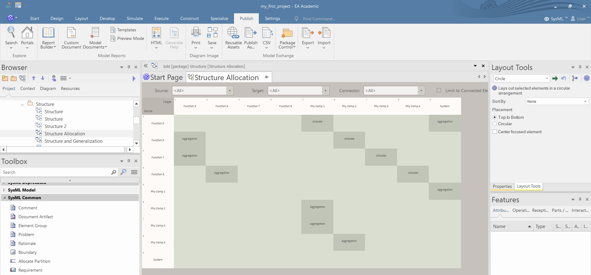

# Simple allocation modeling

1. You can use the alloation relation to define the allocation between blocks. You can find the "Allocation" tool in the "SysML Block Relationship" and in the "SysML Common" toolboxes.

2. You can right click on the diagram and uning the "Switch View/Relationship Matrix View" command you can go into table view.

3. You can filter the allocations if you select "*SysML1.4::allocate*" in the "*connector*" menu.

4. You can add new allocations if you right click in any cell and select the "Create New Relationship/Allocated to" command. **This command only works properly if the connector filter is turned off.**

# Detailed allocation modeling
1. You can create a detailed allocation model, where you can allocate the internal properties of the blocks. Firstly, you shall create a BDD and add the "top-level" blocks. Make sure that the blocks have a structure model and the size of the blocks in the allocation diagrams are bigger then the largest IBD of the blocks.

2. Copy-paste the content of the IBDs of the blocks into the allocation diagrams.

3. Define the allocation between the part properties using the "*allocation*" relation.

# Allocation using matrix view
1. You can define allocation using the matrix view if the source and the target of the allocation relations are in different packages. You shall select the package of the source of allocation and click on the the "Package/Matrix / Open as Source" command in the "Design" menu.

2. Select the target package using the "Locate Package in Browser" command.

3. Set the type of the allocated elements "Type" field. This way you can add new filters.

4. Set the type of relationships to "Allocate" in the "Link Type" field.

5. In the table you can add new allocation relationships by right clicking on a cell and using the "Create new relationship" command.
