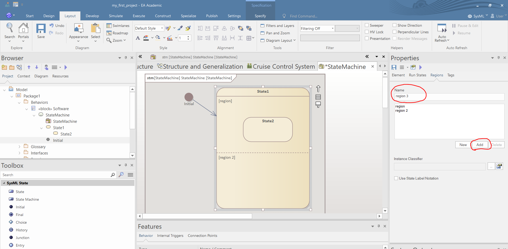

# Statemachine modeling

 - You can create a statemachine diagram if you right click a block and select "*Add/ State Machine*". Then name the statemachine and click "*OK*".

 - Create composite states by moving other states into other states.

 - Create multiple paralell regions within states in the "*Regions*" tab of the Preferences window. Define the name of the region in the "*Name*" field and click "*Add*".

 - You can define the guard of a transition if you select a transition, and in the "*Constraint*" tab of the Preferences window.

- In the "*Constraint*" tab of the Preferences window you can add triggers to transitions if you click "*New*" specify the name of the trigger and click "*Save*". The name and the label of the trigger is not affected by the type and the specification of the trigger. As a result, you should mind follow the syntax of the trigger labels when you define the name of triggers.
  - 
  - 
  - 
 - In the "*Constraint*" tab of the Preferences window you can activites as effects of transitions if you set the "*Effect is a Behavior*" option. 

 - You can set the entry, do and exit actions of states in the "*Behavior*" tab of the Feature window. Firstly, you define the name of the action and if you double click the name of the action you can specify the referenced activity.

# Activity modeling

Work in progress...

# Sequence modeling

Work in progress...