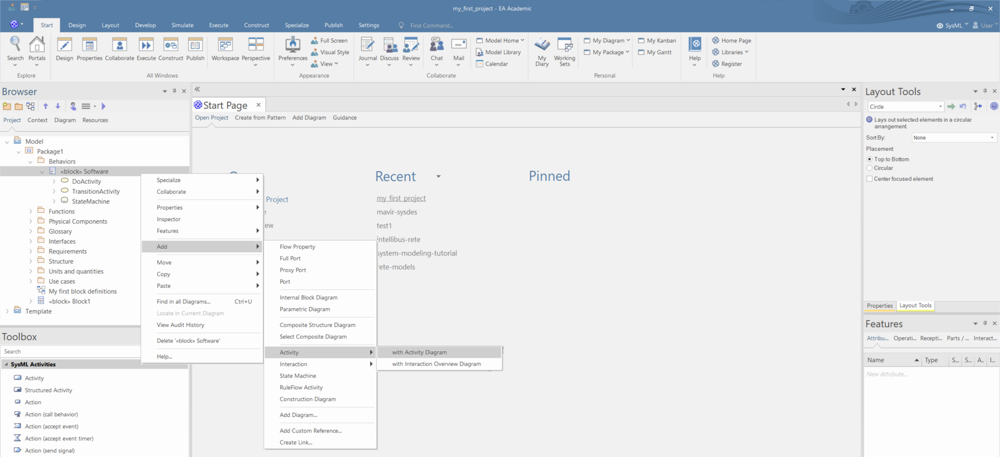

# Statemachine modeling

 - You can create a statemachine diagram if you right click a block and select "*Add/ State Machine*". Then name the statemachine and click "*OK*".

 - Create composite states by moving other states into other states.

 - Create multiple paralell regions within states in the "*Regions*" tab of the Preferences window. Define the name of the region in the "*Name*" field and click "*Add*".

 - You can define the guard of a transition if you select a transition, and in the "*Constraint*" tab of the Preferences window.

- In the "*Constraint*" tab of the Preferences window you can add triggers to transitions if you click "*New*" specify the name of the trigger and click "*Save*". The name and the label of the trigger is not affected by the type and the specification of the trigger. As a result, you should mind follow the syntax of the trigger labels when you define the name of triggers.
  - 
  - 
  - 
 - In the "*Constraint*" tab of the Preferences window you can activites as effects of transitions if you set the "*Effect is a Behavior*" option. 

 - You can set the entry, do and exit actions of states in the "*Behavior*" tab of the Feature window. Firstly, you define the name of the action and if you double click the name of the action you can specify the referenced activity.

# Activity modeling

1. You can create an activity diagram if you select *SysML* persepective and you right click on any block or package and select "*Add/Activity/with Activity Diagram*". In the pop-up window specify the name of the activity and press "*OK*".
   
   
2. Drag and drop elements from the "Toolbox" to create new elements in the activity diagram.

3. Add actions from the Toolbar and int the pop-up menu select the type of the new action.

4. In the case of "*Send*" and "*Accept*" actions, you can specify in the "*Properties*" window the port of the actions in the "*On Port*" field in the "*Element*" tab.

5. You can specify the transmitted or recieved signal in the "*Signal*" of the "*Condition*" tab in the "*Properties*" window.

6. Unfortunately none of these properties is visualized in the diagram, therefore it is strongly advised to add a note, which contains all these information.

# Sequence modeling

1. You can create a sequence diagram if you right click an element in the "*Browser*" and select add diagram and choose "*Sequence Diagram*".

1. You can create new objects with lifelines using by draging "*Sequence*" elements from the "*Toolbox*".

1. Alternatively, you can drag and drop existing elements from the "*Browser*" into the diagram. The Enterprise Architect will automatically add lifeline to the elements. Moreover you can add properties of the elements to the diagram.

1. Using the "*Toolbox*" you can add messages into the diagram.

1. You can add signals and data objects to the messages if you right click on a message and select the "*Advanced/Information Flows Realized*" command. In the pop-up windows you shall click on "*Create new information flow*" field and select a Class or a Signal.

1. You can add duration and timing constraints to messages if you right click on a message and select "*Timing Details*". In the pop-up window you can specify the timing related constraints and observations.

1. You can set the synchronicity type of a message if you right click on a message and select the "Toogle IsReturn" command.

1. You can modify the lifeline activations if you right click on a message and select the "*Activations/Extend Source Activation*" commands.

1. You can add fragments using the toolbox.

1.  You can add multiple region to a fragment by adding new conditions in the "*Combined fragment*" tab of the "*Properties*" window. 
