# Containment modeling

1. Check that the template package is configured in the "*Settings/Settings/Project Template Package...*"  
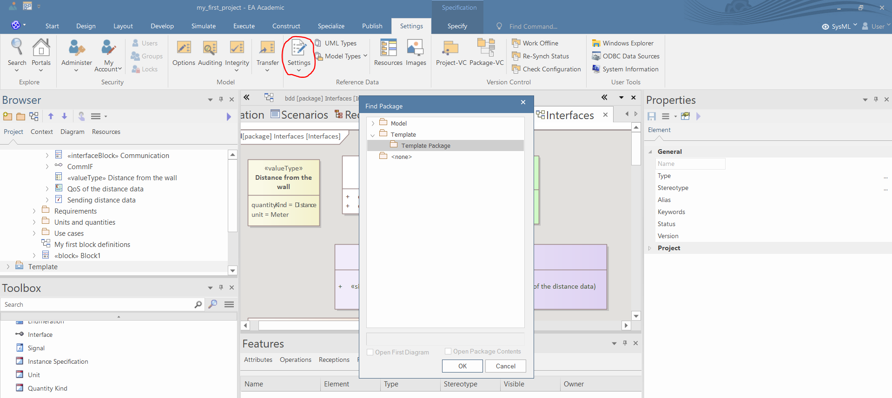
1. Create a BDD and define some blocks using the Toolbox. The new blocks will appear in the Browser.
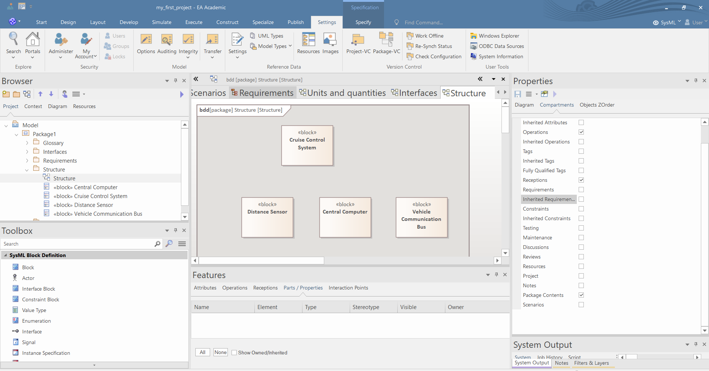
2. Define the composition between the components using the "*Part Association*" relation tool in the Toolbox. This way you can create part properties of the blocks. You may use the "Shared Association" or the "*Reference Association*" tools to create reference properties of the blocks. The new properties will appear in the Browser and in the "*Part/Properties*" tab of the "*Features*" window (if you select the block). 
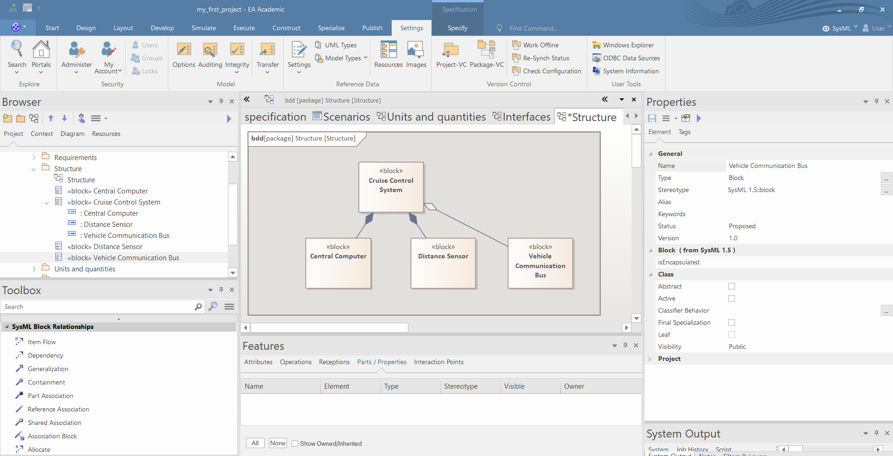
3. Define the name and the multiplicity of the part and reference properties in the "*Source*" tab of the Properties window.
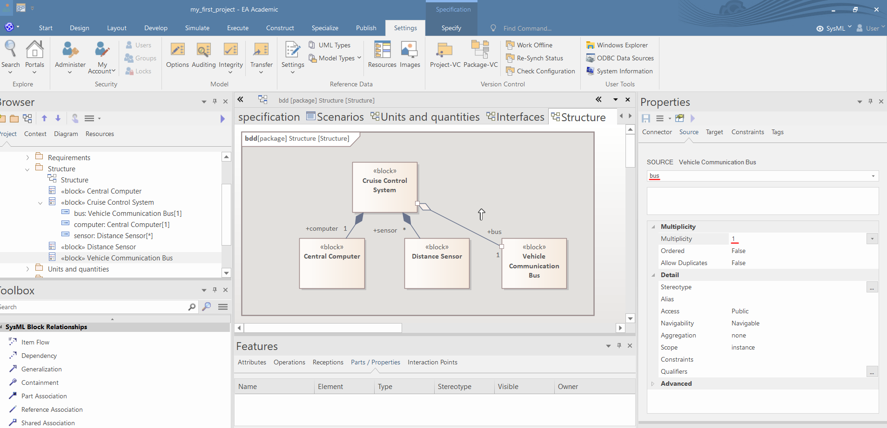

# Modeling ports

It is advised to define the ports of the blocks in the BDD. You may use the Browser and the Features windows to create ports but the usage of BDD make the process much more convinient.

1. You can add the "*Port*", "*Proxy Port*" and "*Full Port*" tools to add different ports to the Blocks. The newly created port will appear in the Browser and in the "*Interaction Points*" tab of the "*Features*" window (if you select the block).
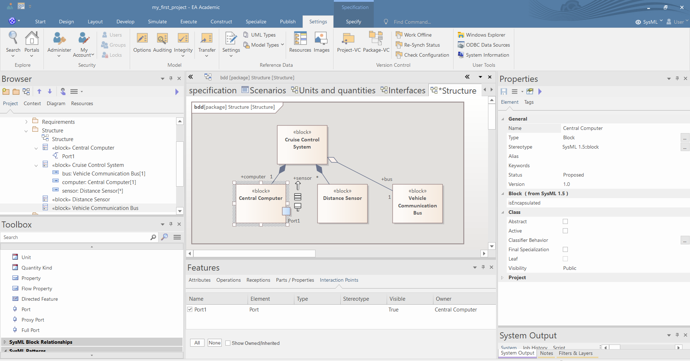
1. You can set the Name, the Stereotypes, the Multiplicity, the Conjugated attribute and the Type of the ports in the Preferences window. If the type of the port contain flow properties then an arrow appears in the ports in accordance with the direction of the flow properties.
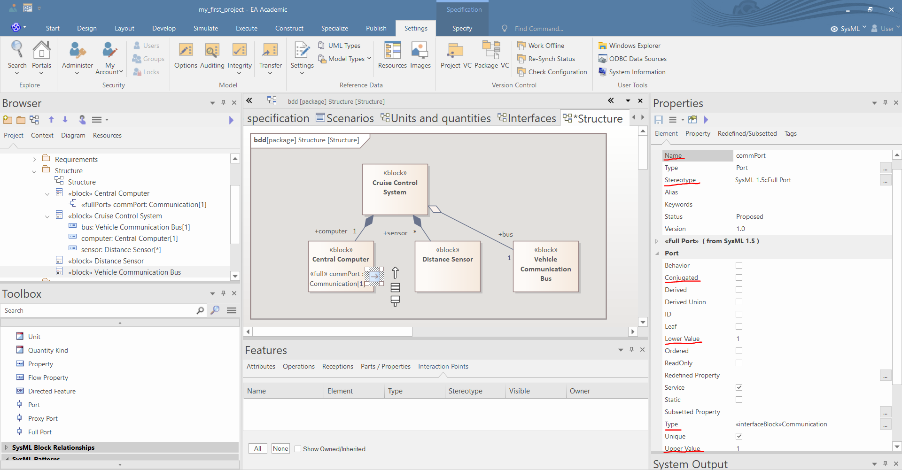
1. In BDDs you can easily copy ports (and another modling elements) if you press CTRL and pull the port from one block to another. Then you may change the name and conjugated attribute of the ports. If a port is conjugated then the arrow of the port (if it has any) changes direction.
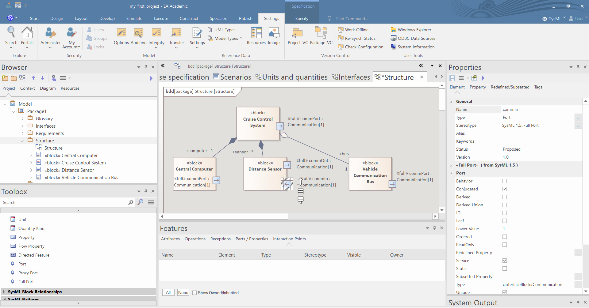
1. You may change the apparance of the diagram if you *delete visually* the ports and turn on the visibility of the ports compartments in the "*Compartments*" tab of the Preferences window (if you select nothing and click anywhere on the diagram).
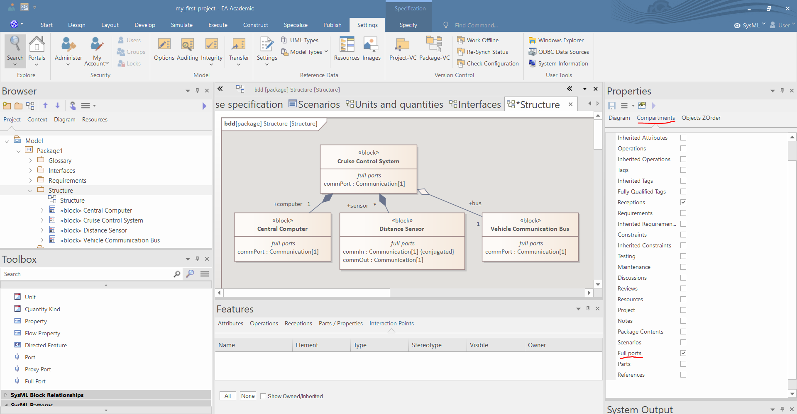
1. You may set the style of the relations to "*Tree Vertical*", by right clicking the relations.
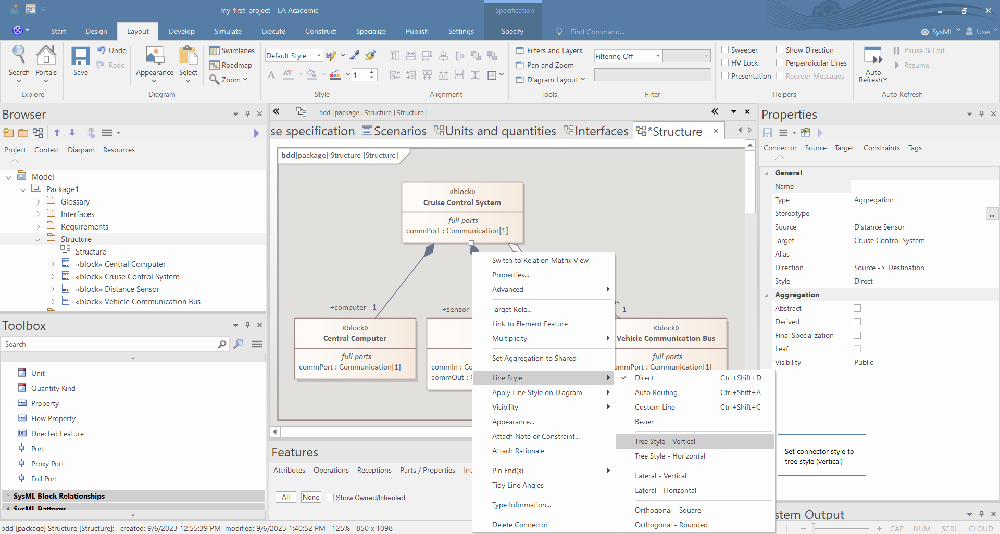
1. You can accelerate this process if you set the style of a relation, right click on the relation and use the "Apply Style on Diagram/Connectors of the Same Type" command.
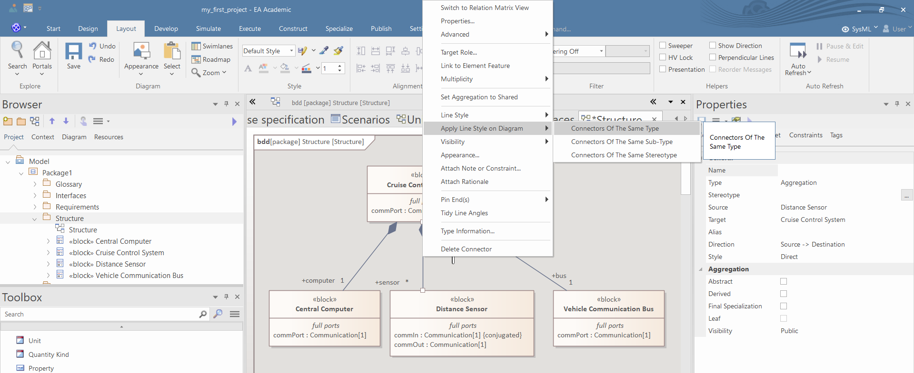

# Generalization and redefine

1. Create a BDD and define some blocks and generalization between them using the Toolbox.
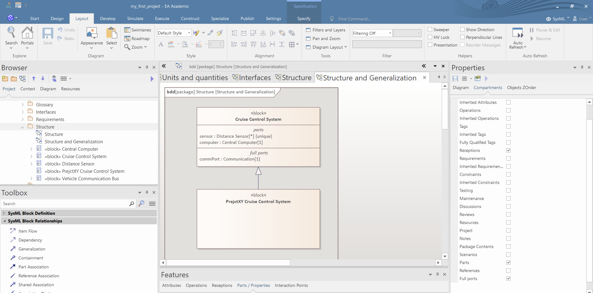
1. If a block generalizes another block then you can copy the parts and ports of the generalized block can be copied to the new block using the Features tab. Turn on the "Show Inherited" property and right click on the inherited parts and properties and choose "*Redefine*". This command makes an identical copy of the original property. Unfortunately, this way the EA forgets that the property is a part property and there is know way to set it.
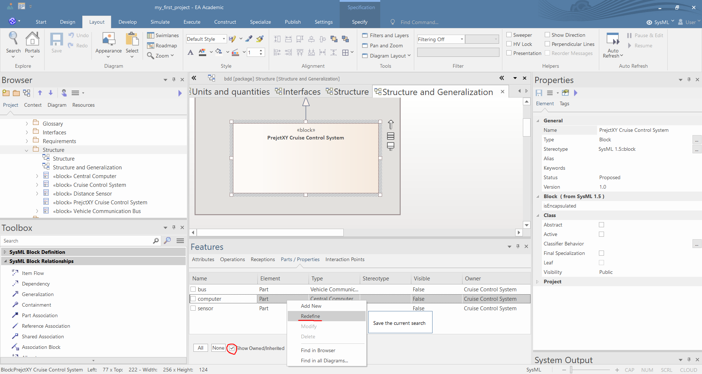
1. Note that the "*Redefine*" command of the EA is not related to the UML's redefine relation. To model that that a property (or port) redefines another property than select the propety and in the Preferences window you can select the redefined property.
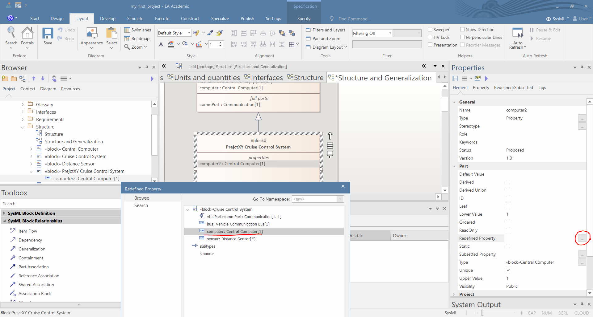
1. After this step the redefined property automatically appears in the BDD. Unfortunately redefined ports cannot be visualized and anonymous ports and properties cannot be redefined.
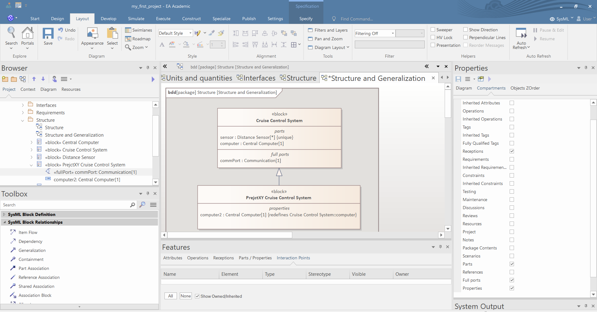
 
