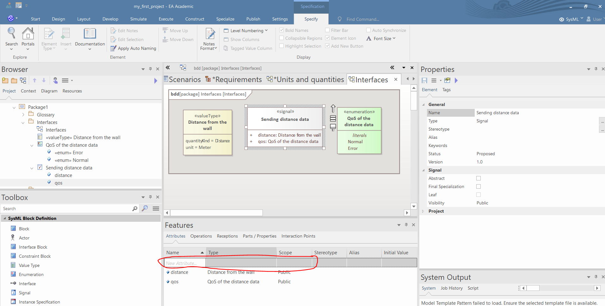
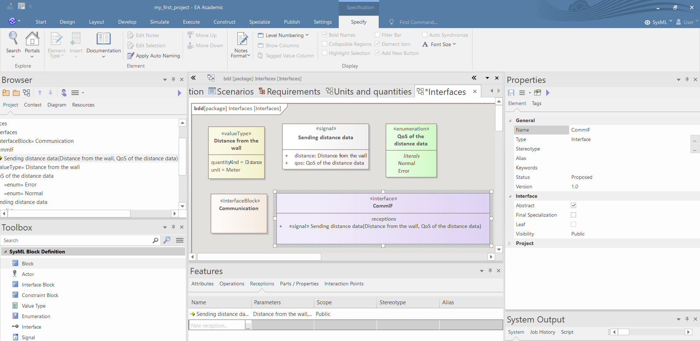
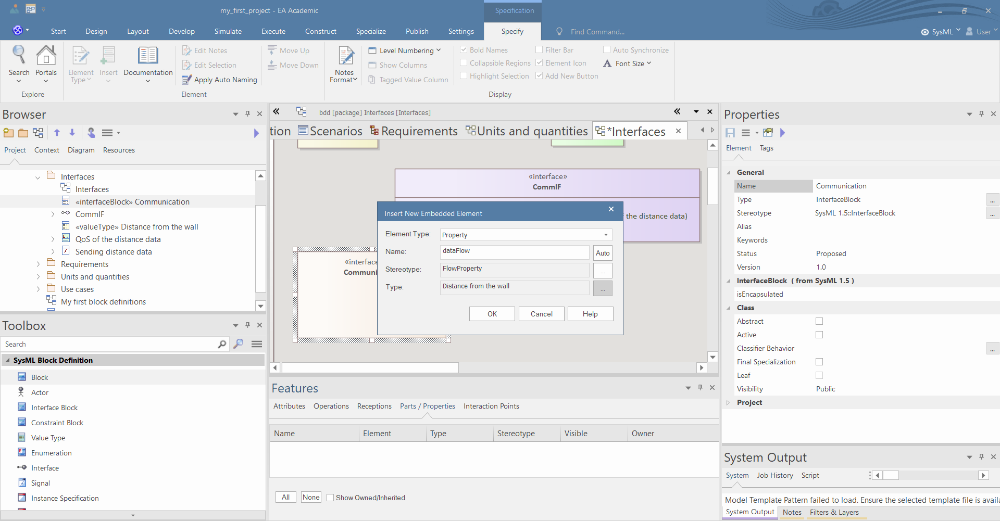

---
title: Data and interface modeling using Enterprise Architect
subtitle: System Engineering (BMEVIMIAC01)
header: System Engineering (BMEVIMIAC01)
---

# Data and information modeling

## Download ISO 80000 library

The *ISO 80000* is an international standard, which defines numeous physicalquantities and units such as, force, distance, time, temperatures. The physical quantities and units are organized into 10 chapters. The OMG published in XML format the SysML model of the units and quantities of the *ISO 80000* standard. 

1. Create a package and right click on the package and select "*Add a Model using Wizard...*".

1. In the SysML1.5 Libraries category select "*ISO 80000 Library (Downloaded)*" and press "*Create Model(s)*". 

**Sometimes the library cannot be downloaded due to server issues of the OMG. If the server issue persists, then download the .xml from our Teams and import it similarly to the import of the template package (see the generic EA guide).**

## Create units and quantity kinds

1. Create a BDD and define some units and quantity kinds using the Toolbox.

1. Set the attribute values of the quantity kinds and units in the Run States tab of the Preferences window.

## Value types, enums and signals

1. Create a BDD and add some value types, enums and signals using the Toolbox.

2. Select the quantity kind and unit of the value types in the Preferences window by clicking on the three dot icon near the attributes.

3. Define the literals of the enums in the Attributes tab of the Features window, by writing the name of the literal in the *New Attribute* field.

4. Define the attributes of the signals in the Attributes tab of the Features window, by writing the name of the attribute in the *New Attribute* field. Set the type and the visibility of the attribute near the name of the attribute.

# Interface modeling

1. Create a BDD and add some interfaces and interface blocks using the Toolbox.

1. Add signal receptions to the interfaces in the Receptions tab of the Features window by clicking on the three dot icon near the *New Reception* label.

1. You can add flow properties to the interface blocks three ways:
      - drag a value type from the Browser and drop it over the interface block and select the *SysML1.4::FlowProperty* in the "*Drop as*" field, and click "*OK*", then rename the property;
      
      - select the interface block and in the "*Parts/Properties*" field right click and select "*Add New*", then fill the form in the pop-up window and press "*OK*";
      
      - use the Toolbar to create a flow property, and set the name, the type and the direction of the flow property in the Preferences window.
      