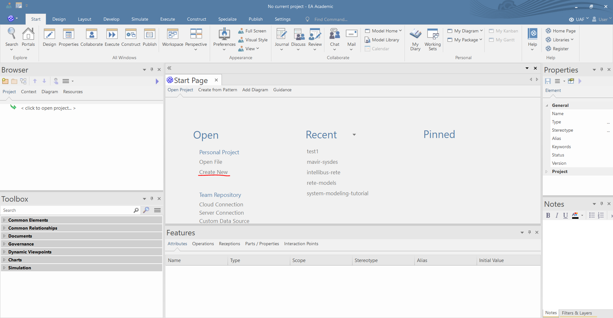
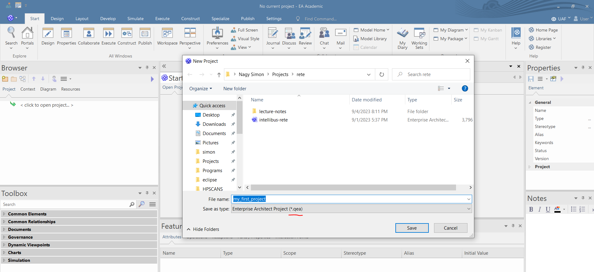
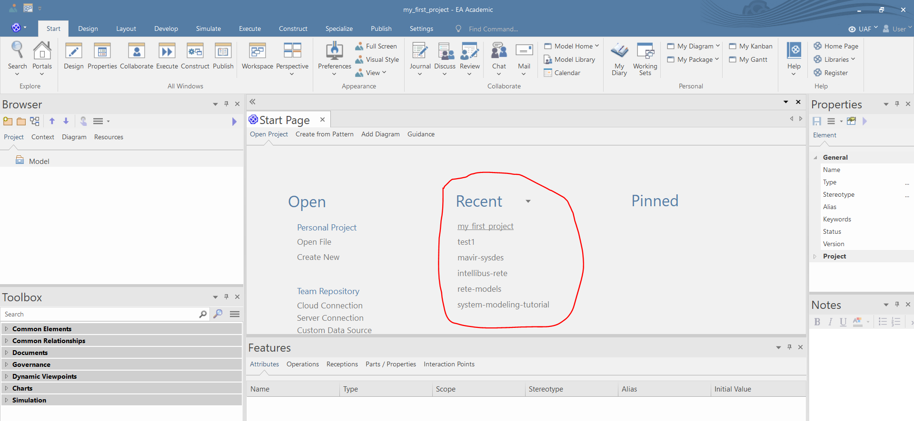
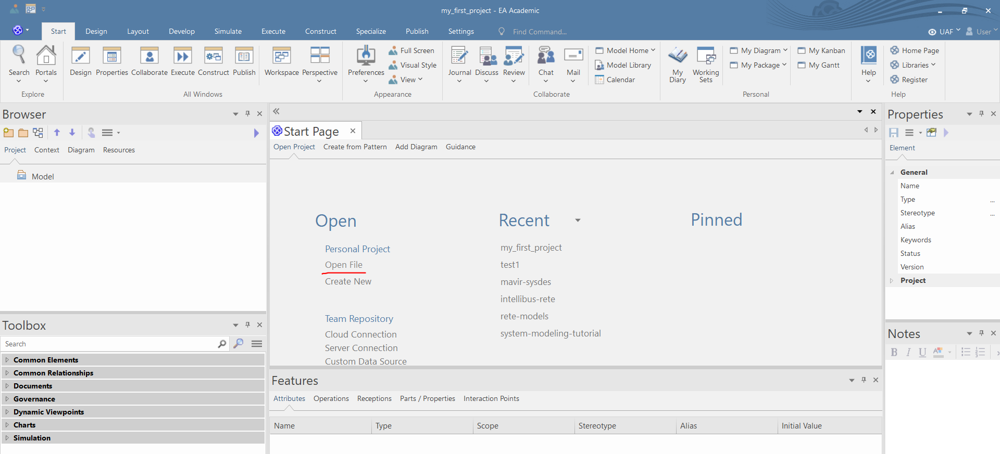

# Create project

1. Click on "*Create New*" in the Start Page

2. In the pop-up window name the file and choose proper extension. For shared projects "*\*.qea*" extension is strongly advised, and click on save.

3. The project is created. In the Start Page you can easily switch between the recently created projects. 

4. You can open existing projects, by clicking on Open Project in the Start Page.

# Create package structure

1. You can create a root-level package by right clicking in the Browser and choosing "*Add Root Node...*".

2. Name the root-level package and click OK.

3. You can add packages to root-level packages by clicking on "*Add Package*" in the "*Design*" menu tab.

4. In the pop-up window name the package and click on OK.

5. Except root-level packages you can add a subpackage, by  either:
   - right click the package in the Browser and choose "*Add a package*", or

   - select the package in the Browser and press CTRL+N and select "*Add a package*"

# Create diagrams

1. Right click on a any (not root-level) package in the browser (or select the package and press CTRL+N) and choose "*Add Diagram*". 

2. In the pop-up window select the type of the diagram and name it. Finally press OK.

3. The new diagram opens automatically and the EA loads all the relevant model creation tools into the toolbox. You can click on any tools in the toolbox to create new elements.

4. You can add additional model creation tools to the toolbox by clicking on the menu button in the right upper corner of the toolbox and choose "*Toolbox Visibility*".

5. Now you can select which groups of tools will be always visible. It isstrongly advised to select "*SysML Common*" and "*SysML Model*".

**Please do not create behavior diagrams by right-clicking and after directly selecting diagram type, becouse this way you will create the UML version and not the SysML version of the diagrams.**