---
title: Structural modeling using Enterprise Architect
subtitle: System Engineering (BMEVIMIAC01)
header: System Engineering (BMEVIMIAC01)
---

# Model properties and ports

1. Create an IBD of a block, and right click on the diagram and select "*Synchronize Structural Elements*".
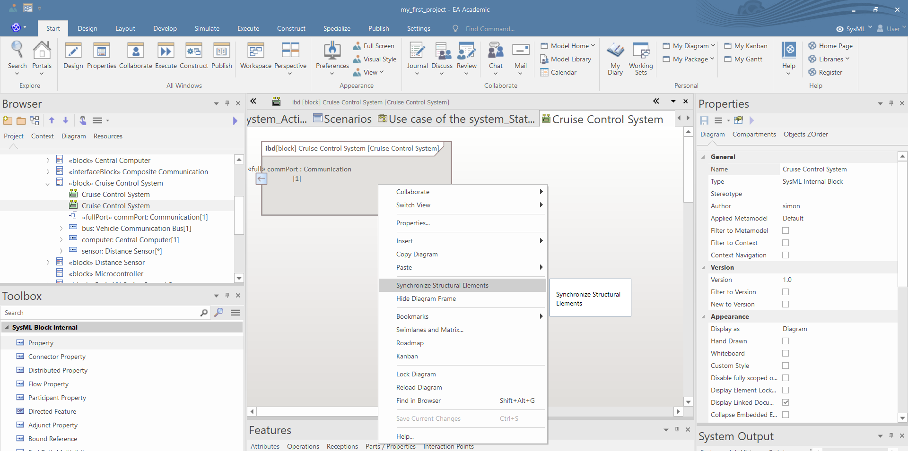
1. In the Interaction Point and Parts/Properties tab of the Features window you can make visible the port and properties of the properties. If you change the name or an attribute of a port or a property, then the type of the containing property will be updated automatically. **Warning: this feature sometimes is a little bit buggy.**
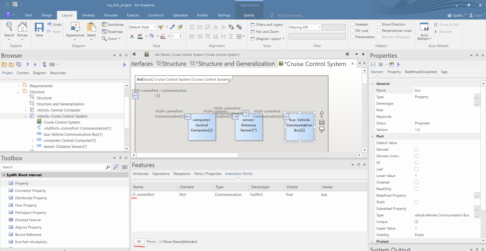
1. Use the tools in the Layout menu to arrange the properties. The allignment tools and the make all propety same size tools can be specially usefuly. **Warning: small properties will be automatically resized if you close and reopen a diagram, so make all property much bigger than neccessary to prevent this.**  It is also advised to move the label of the ports inside the properties.
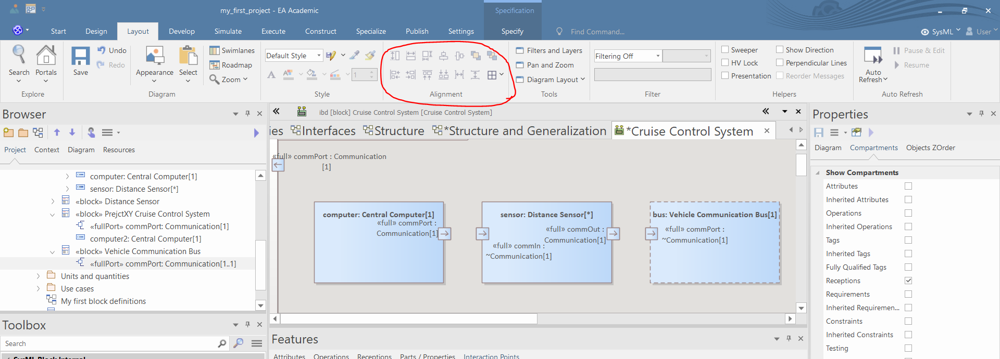
1. You can add ports and properties to the the block of the IDB or to the properties of the block by dragging blocks into the diagram and selecting property or port in the "*Drop as*" field. Note that this way the new porerty will **not** apprear as part property.
   - 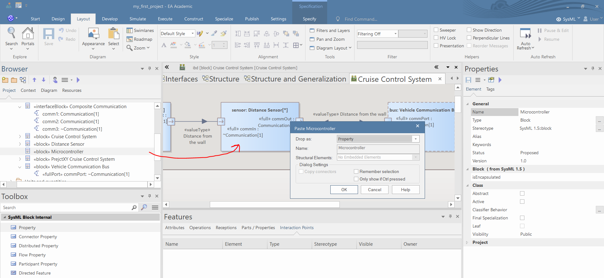
   - 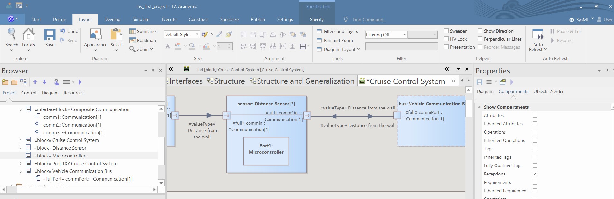

# Model connections and information flows

1. Create connectors and information flows using the Toolbox. Alternatively, if you can select a port or property and drag the arrow in the upper-right corner of the property and select the type of the connection.
   1. 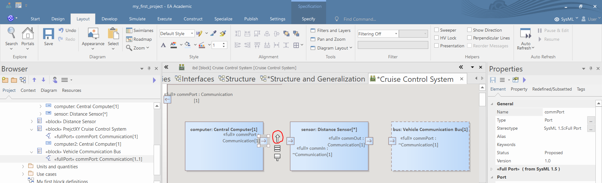
   2. 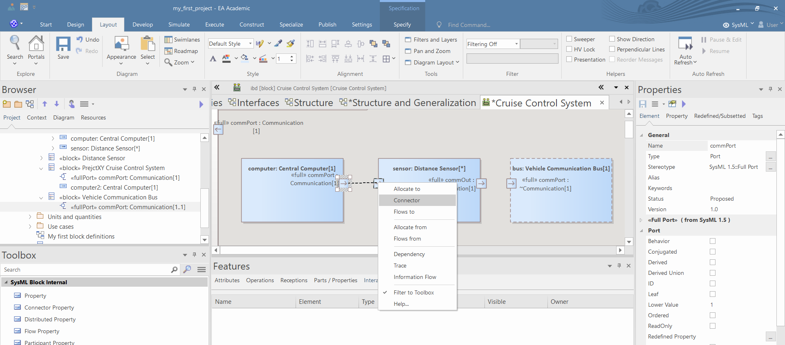
1. You can add information flow to connector, by right clicking the connectors and choose "*Advanved/Information Flows Realized...*". Then you can select the type of the flowing information.
   1. 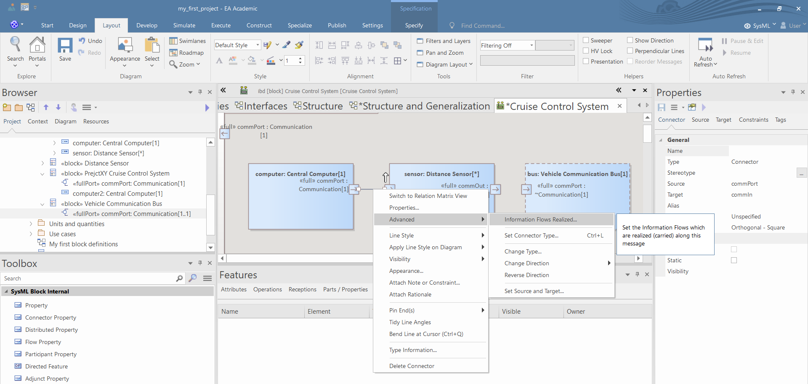
   2. 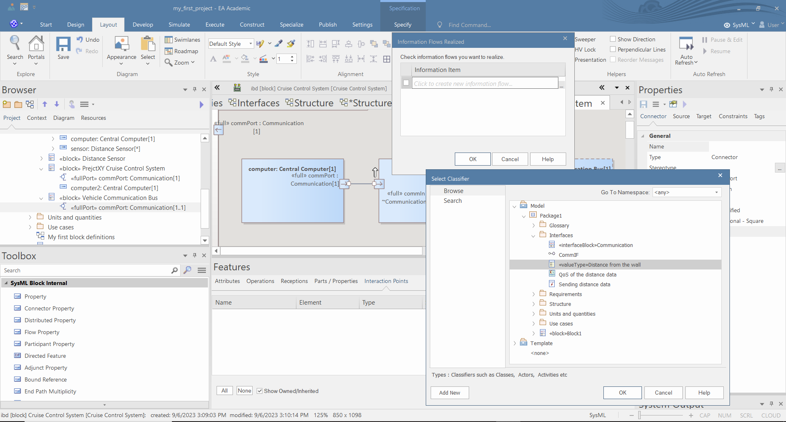
   3. 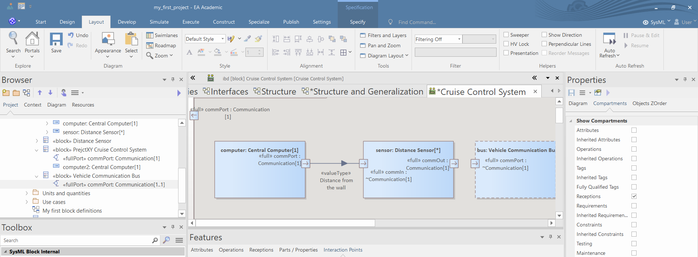
2. If two properties and ports are connected with a connector and with multiple information flows then you can use "*Advanved/Information Flows Realized...*" settings to add the information flows to the connector
   1. 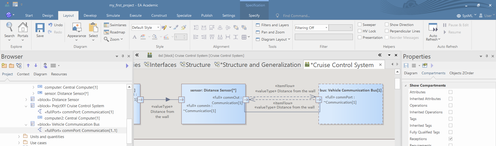
   1. 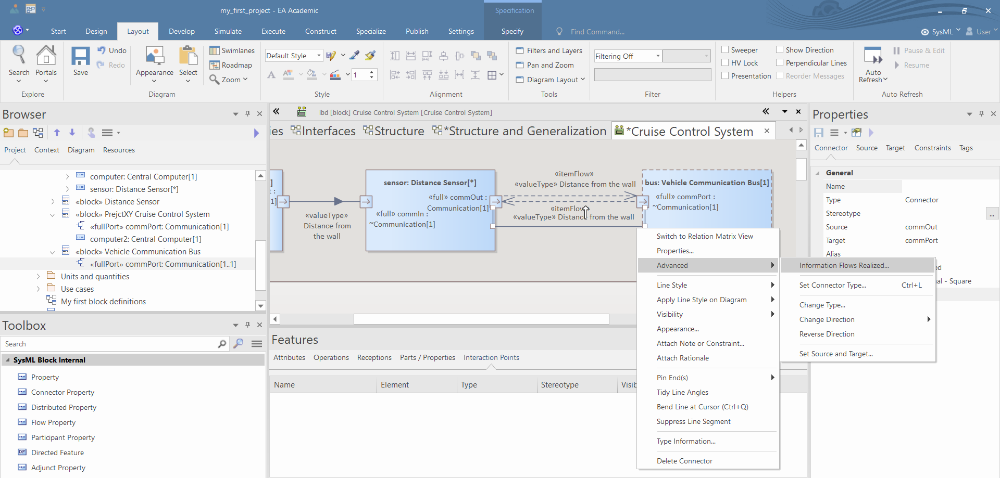
   2. 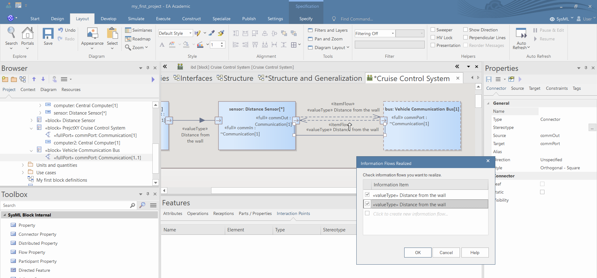
   3. 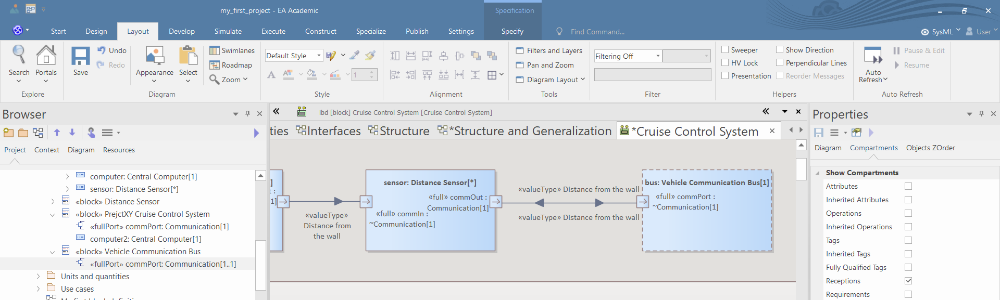

# Model composite ports

1. Define a block, which has some ports.
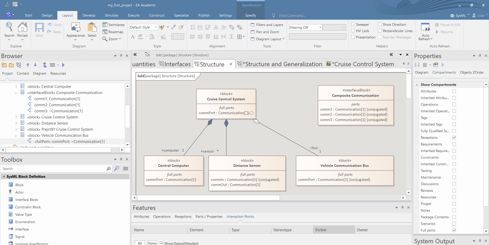
1. Define some ports with the new block as a type.
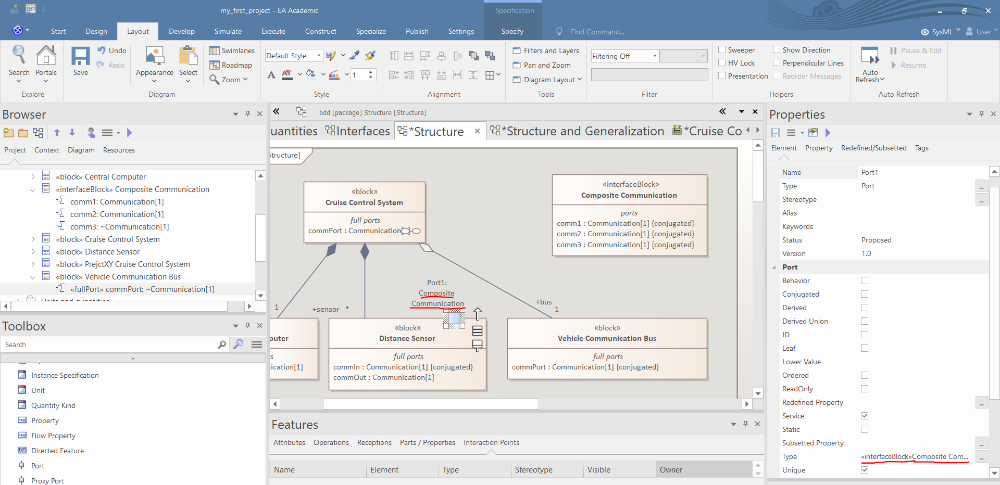
1. Select the port and visualize the sub-ports in the "*Interaction Points*" tab of the Features window. (This approach also works in IBD.)
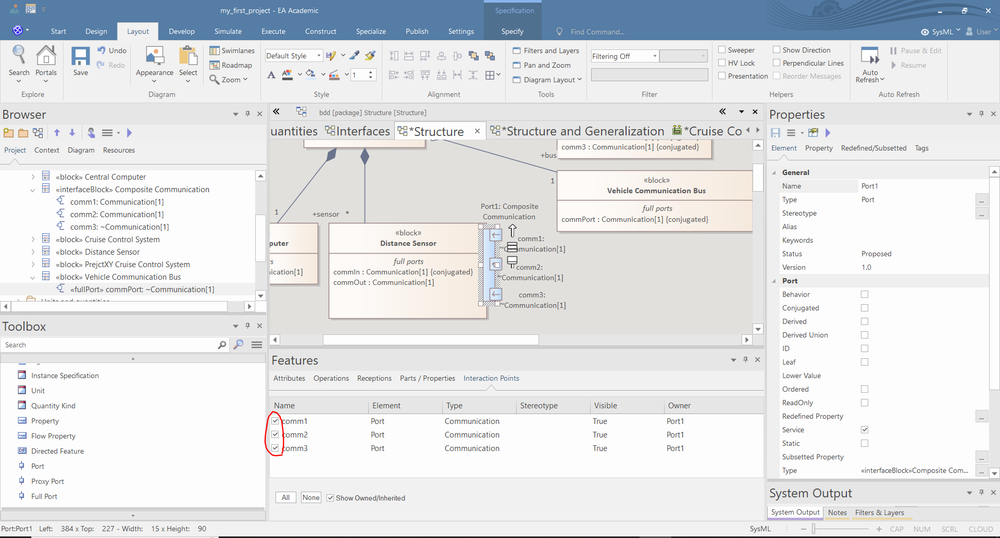
1. If the composite port is conjugated then the arrows of all sub-ports will change direction.
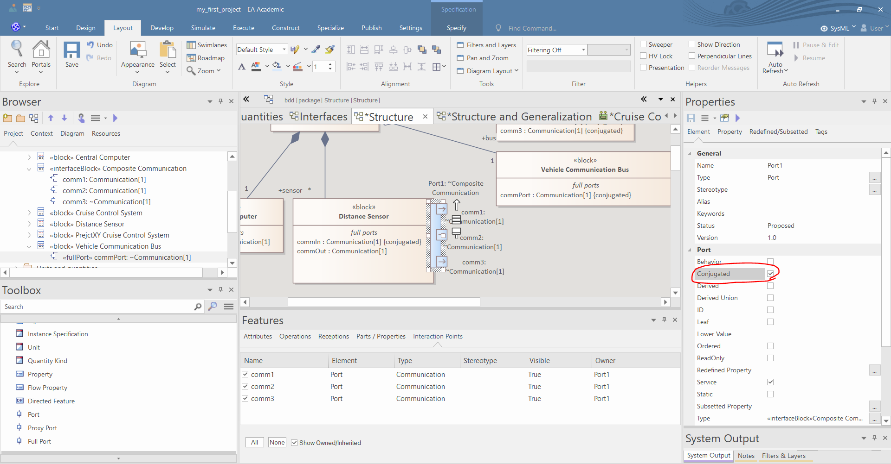

