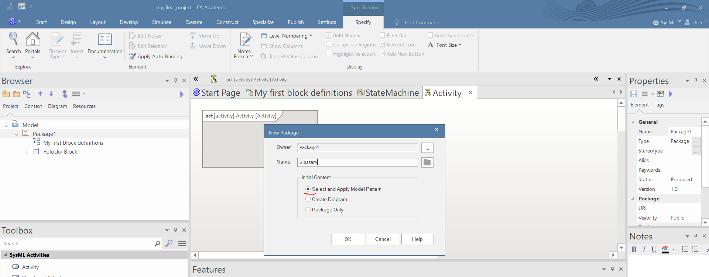
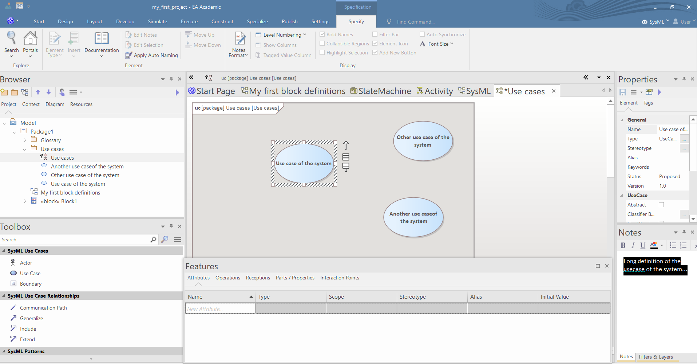
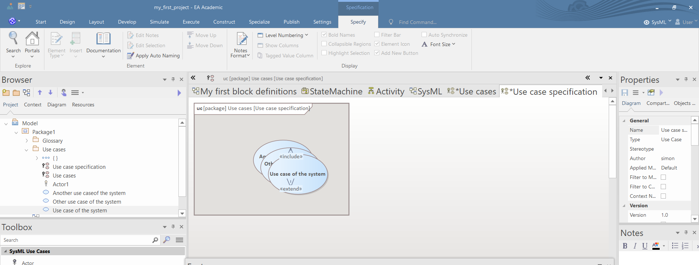
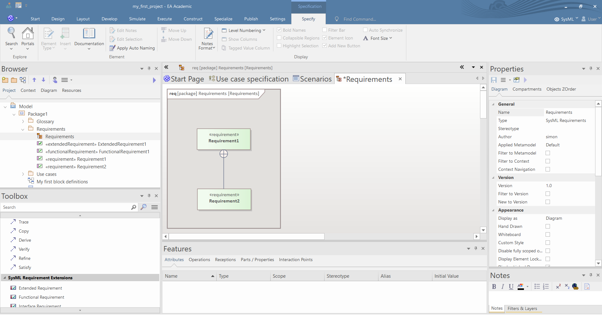
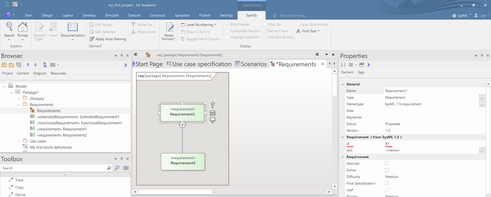
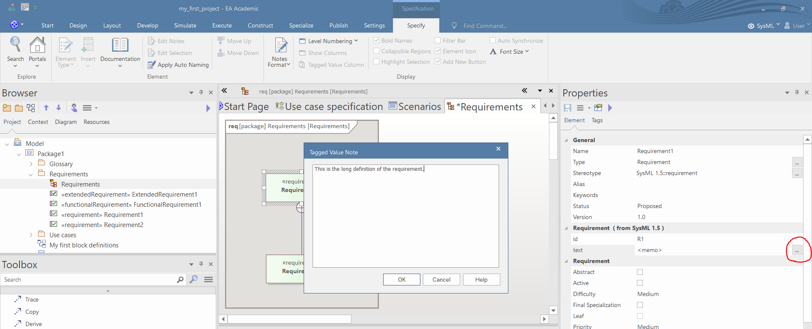
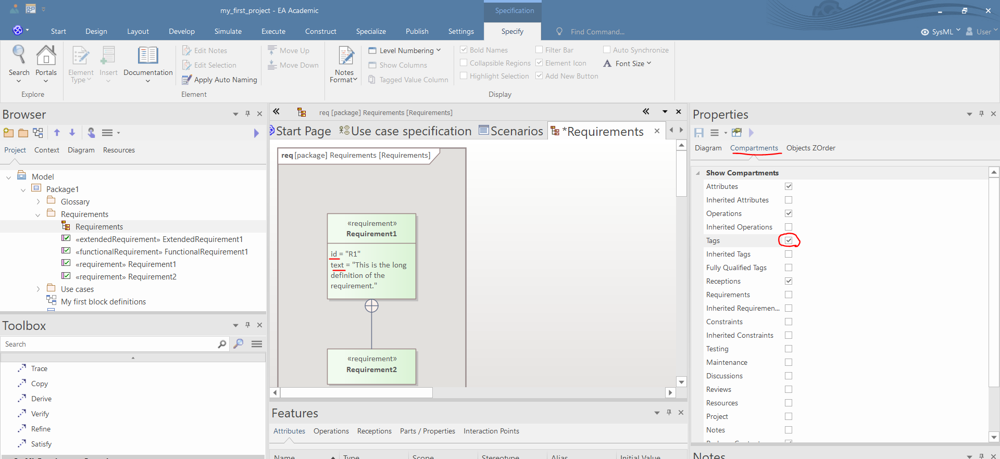

# Create a glossary

A glossary can be created multiple ways, this tutorial show the simplest one. In EA the definitions are modeled by classes with *\<\<GlossaryEntry\>\>* stereotype. The name of the class is the defined expression and the note of the class is the definition of the expression. The glossary entries are organized into categories, which are packages with the *\<\<GlossaryCategory\>\>* stereotype. The glossary is an UML class diagram, which is in "*Specification View*".

1. Create a package and select the "*Select and Apply Model Pattern*".

1. Choose the "*SysML Glossary*" pattern. This pattern will create a simple glossary with the definitions of the SysML's modeling elements. Click on "*Create Model*"-

1. Right click on the glossary diagram and select "*Switch View/Graphical View*".

1. Delete all the glossary entries except one and rename the remaining entry and modify its note. Using the toolbox you can add new categories and entries. After you finished the glossary definitions change the view of the diagram back to "*Specification*" mode.

1. Alternatively you can add glossary entries if you set the perspective into "*Publishing/Glossary*" and click on "*Add New*".

# Use case modeling

1. Create a SysML use case diagram and define some use cases using the Toolbox. Add some notes to the use cases.

1. Define the actors, the boundaries of the system using and the relations between the modeling elements using the Toolbox.

1. Create another usecase diagram and pull the previously defined usecases into the diagram. You may give the diagram a name similar to "*Use case specifications*".

1. Change the view of the diagram into "*Specification View*".

# Requirement modeling

1. Create a requirement diagram. Define some requirements using the Toolbox.

1. In the Properties window set the ID of the requirement.

1. Set the Text of the requirement by clicking the three dot icon in the Properties window. In the pop-up window write the text of the requirement and press OK.

1. If the Text and the ID does not appear in the diagram, then click on the diagram, and in the Compartments tab of the Properties window turn on the visibility of tags.

1. For SysML Requirement Extensions the attributes of the requirements can be specified in the Properties window.
