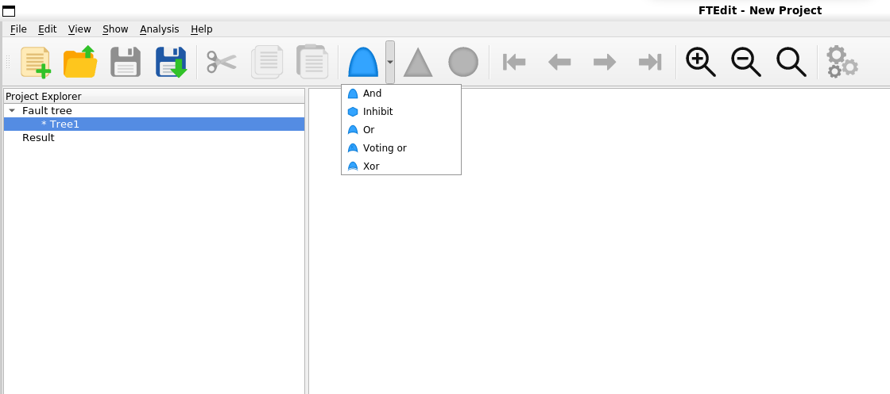
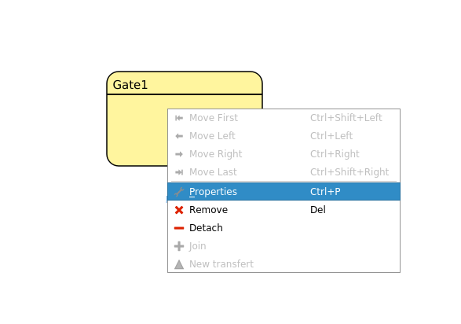
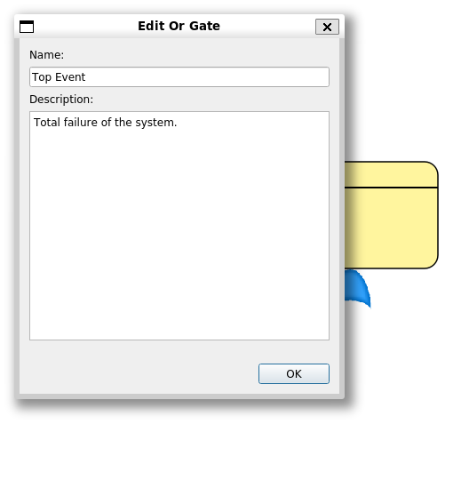
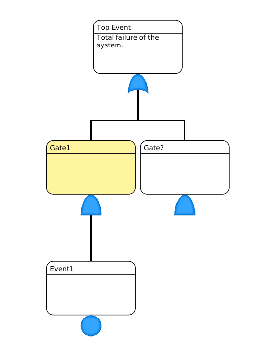
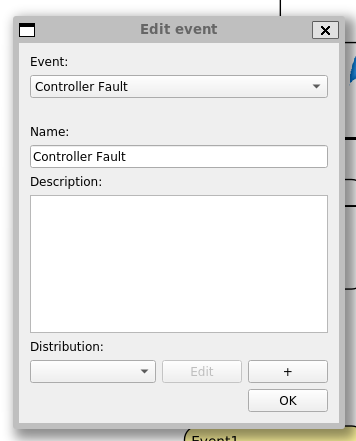
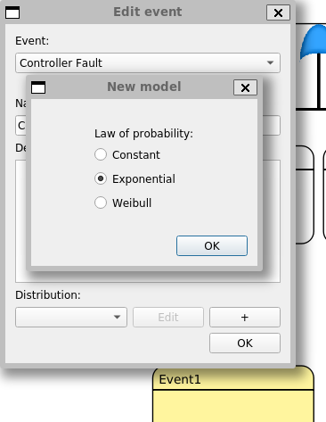
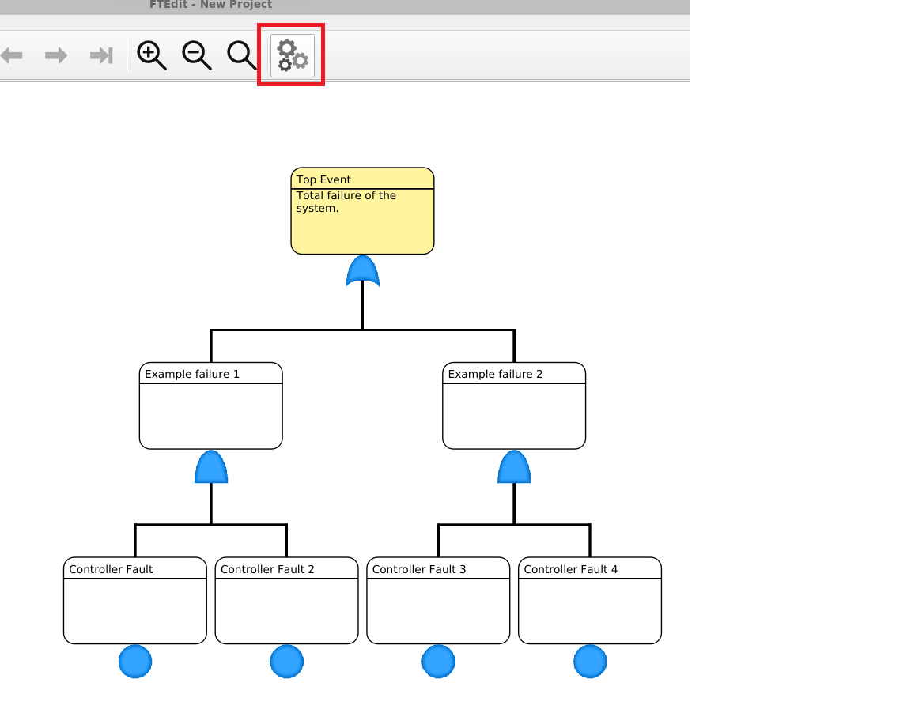
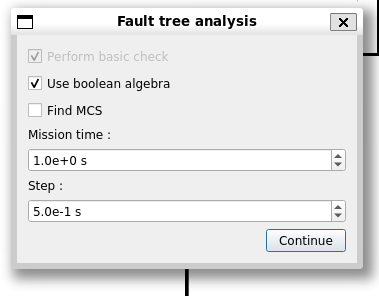
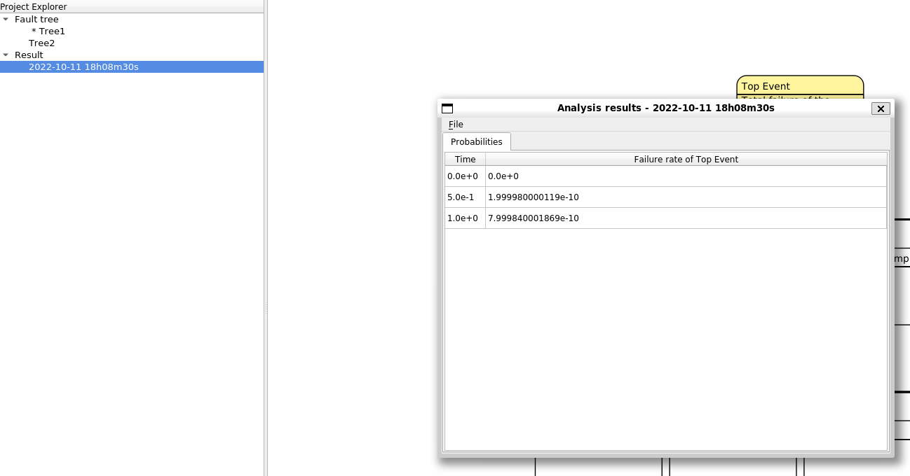

# Introduction

FTEdit is an open source fault tree editor tool for static fault trees. 

# Installation

The repository of the tool can be found **[here](https://github.com/ChuOkupai/FTEdit)**. For **Linux** installation follow the instructions found in the README, for **Windows** installation use precompiled **[binaries](https://github.com/ChuOkupai/FTEdit/releases/tag/v1.0)**.

# Modeling Fault Trees

1. You can select **Gates** from toolbar. _Top Event_ is not an option here, so select an _Or Gate_ as the root of the Fault Tree.

2. You can edit the properties of the gates in the **Right Click**->**Properties** menu or with the **Ctrl+P** shortcut. Use meaningful names and descriptions!

3. You can add further children to gates after selecting them.

4. To add a _Basic Event_ to a gate select the **Basic Event** from the toolbar and enter the properties window: **Right Click**->**Properties** (**Ctrl+P**). Set the name and the description of the event, then select a _distribution_ from the list or add a new one using the **+** button.
    - **Exponential** models can be used to compute the unreliability of a component with exponentially distributed failure time based on its failure rate and the mission time set when executing the analysis. 
    - **Constant** models can be used if the probability of the event is determined outside of FTEdit (e.g. asymptotic availbility is computed using a different formula). Constant can be used for the unreliability computation of exponentials as well by setting the probability to 1-e-λt.
5. Select the **Exponential** or the **Constant** option -> Click on **Edit** -> Set the name of the distribution and the value .

# Evaluating Fault Trees

1. To evaluate a _Fault Tree_ select the _Top Event_ and click on the toolbar or use the **Ctrl+Shift+E** shortcut.

2. Select the **Use boolean algebra** option and set the **Mission Time** and the **Step**.

3. The results can be found in the **Project Explorer**

