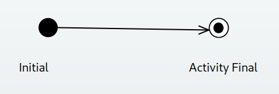
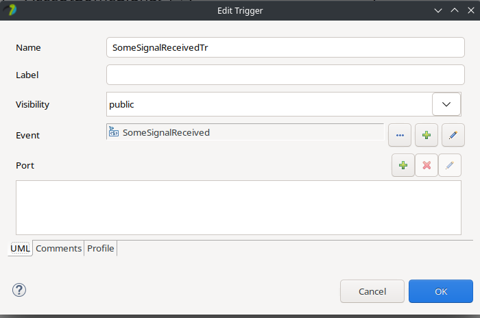
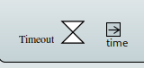
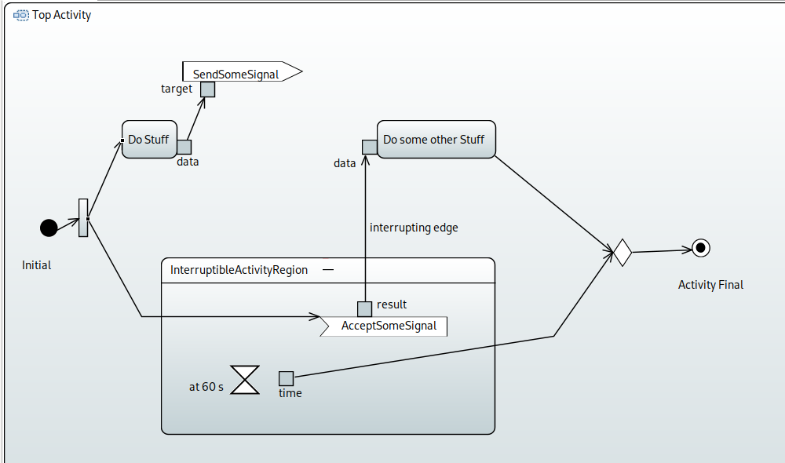

 
# Diagram creation

Inside the Model Explorer windows of Papyrus, right-click the destination package, and choose _new diagram_/_SysML 1.6 Activity Diagram_.

To rename the diagram, enter some name in the pop-up windows.

If everything worked, Papyrus should be showing an empty Activity inside the newly created diagram. Note that as always, Papyrus does not show a diagram header or a diagram frame, which contradicts the SysML standard. Instead, we can think of the activity's boundary as the diagram frame.

# Creating a simple diagram

From the palette to the right, grab an _initial_ and an _activity final_ element, and drop them on inside the main activity's frame. Furthermore, pick _control flow_ from the palette, and connect the two elements. The resulting diagram should look like this: 

And in the model explorer, the following new elements should be visible (also, you can rename the top-level activity to something more sensible):

# Adding actions

To add an _opaque action_ (i.e., one without a defined inner structure), right-click the top-level activity in the model explorer, and choose _Opaque Action_ from the _UML for SysML 1.6_ submenu of the context menu. Note that you can duplicate elements in the model explorer using ctrl+c and ctrl+v, so keep a "template" opaque action available to avoid having to always select the element from the complicated menu structure. 

Then, drop the newly create opaque action onto the diagram, break up the connection between the initial and activity final nodes, and insert the opaque action in-between. Even though Papyrus always offers the possibility to add a label to an edge, refrain from using this feature, because diagrams get very complex very fast.

An alternative to the solution for adding an opaque action above, is to start drawing an edge from a node, and Papyrus will offer to create a new element. Choose an opaque action here. 

# Adding pins

So far, all edges have been control-flow edges. To add object flow as well, we need to define output and input pins on actions (possibly including the top-level activity). To do so, drop an output pin from the palette onto the opaque action created in the previous step. Then, create (in the model explorer) a signal, and add that as the type of the pin. Do not leave pins untyped!

Do the same process with an input pin on another opaque action. You can find the input pin under the output pin's drop-down menu.

So far, the diagram should like something like this:

To connect the two pins, draw an _object flow_ from the palette between them. Notice that even though SysML defines different graphical syntax for the control- and object-flow edges, Papyrus shows them both using the same notation -- be sure which type you use. The diagram will look like this after the connection will have been established:

# Adding signal-related actions

So far, the object flow represented a direct and synchronous communication channel. In SysML, there is an alternative to this: sending and receiving signals. You can find these elements under the _Send Signal Action_ element's drop-down menu in the palette.

If you add a _send signal action_ to the diagram, Papyrus prompts you to select which signal to send, or allows you to create one. Choose the previously created signal. 

Adding a signal type to an _accept event action_ is a bit more complicated, because an _event_ is much more than a _signal_. So, when you create an _accept event action_, it does not prompt you to choose a signal, but rather lets you define a _trigger_ in its properties window. 

As we want to catch signals, choose the _SignalEvent_ option from the Add Event drop-down.

First, choose under which element to create the trigger (the most straightforward option is to choose a package).

Add a name for the new SignalEvent, and choose the corresponding Signal (the one picked out when creating the _send event action_).

If everything went well, the new trigger should look like this. 

These actions above should result in the following diagram. Note that the pins on the send/receive actions are properly typed using the signal.

To connect the elements, create object flows again.

# Interruptible Regions

Unfortunately, Papyrus has a [bug](https://bugs.eclipse.org/bugs/show_bug.cgi?id=521614) where an InterruptibleActivityRegion cannot have children. Instead, we can use an Activity from the palette (which would be used to model embedded behavior) and simply name it _InterruptibleActivityRegion_. We can do the same with an interrupting edge: adding a label asserting its type.

# Time event creation

To let something cancel the _accept event action_ added in the previous steps, let's add a timeout event to the interruptible activity region, which will cancel the wait after some time. 

Do the same as before by adding an _accept event action_, but choose _TimeEvent_ from the dropdown on its trigger.

Choose the container (a package, as before).

You have two choices (do not do both):

1. Name the time expression using the required timing (e.g., "60 s"); or
2. choose a literal from the Expr drop-down, and document its unit of measurement (seconds) somewhere, e.g., as a note.

Name the time event something sensible, and click OK. Pay attention to the "Is Relative" radiobuttons, because this determines whether the time action should be counted from the beginning of model execution (false), or the beginning of node activation (true).

This has created an accept event action that waits for some timeout event. However, we cannot see this on the diagram.

Even though the previous steps more or less correctly created the timing actions, they do not appear on the diagram. The alternative (and much easier) way is to create an empty TimeEvent trigger, and just use the name of the accept event action to assert the time event's value:

Depending on the relative-ness of the timeout event, you can use "after:

or "at":

All this together should look like this on the diagram:

What's still missing, is the activation of the interruptible activity region, for which we can use a fork from the initial node:

and also a way for the timeout event to interrupt the interruptible activity region:

Notice that a merge node was more suitable for the task (rather than a join), because we want to exit the activity if _one_ of the two inputs become active.

