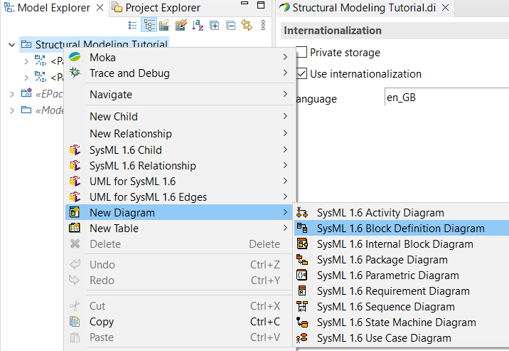

# Block Definition Diagram

## Diagram Creation

1. **Right click** on the selected _Package_ (_Requirements_ in this example) -> **New Diagram** -> **SysML 1.6 Block Definition Diagram**.
1. In the pop-up window give a name to the diagram.
1. _Hint_: During BDD modeling the most used groups from the **Palette** are the **Blocks** and the **Ports and Flows**, so pin these.

## System Context
To add an _Actor_ during _System Context_ modeling:
1. Select _Actor_ from the toolbox: **Palette** -> **Blocks** -> **Actor**.
1. Place it on the diagram.
1. Edit the name in the **Properties** window.

## Block Creation and Settings:
1. Select _Block_ from the toolbox: **Palette** -> **Blocks** -> **Block**.
1. Place it in the diagram, _Hint_: by holding the mousebutton and drawing a square the size of the block can be altered.
1. Add a name to the _Block_. (You can always change it in the **Properties** window.)
1. A blokk compartmentjei közül automatikusan megjelenik az Attributes, az Operations és a constraints; ezek gyakran feleslegesek, megjelenítésük állítható: 
    - Ctrl-F5 vagy
    - blokkon jobb katt -> Filters -> Show/Hide Compartments 
    - több blokkot egyszerre kijelölve egyszerre is állíthatóak, nem kell egyesével
1. A blokkhoz új (SysML értelmű, az az part/reference/etc.) property a Properties ablak UML fülén az Owned Attributes részen adható hozzá a jobb oldali + jelre kattintva, és a - jellel távolítható el
    - ennek leginkább a primitív típusú property-knél van haszna, mivel mind port, mind blokkal típusozott property könnyebben adható hozzá a toolbox és kapcsolatok segítségével

## Relations between Blocks

1. Toolbox -> Blocks csoport -> Association lenyitható, egybe vannak csoportosítva a különböző lehetséges asszociációk (mindig a legutóbb használt kerül a kiemelt helyre)
    - Csak az Association (Directed)-et és a Composite Association (Directed)-et használjuk ezek közül
    - A sima Associationnel vigyázva kell bánni: nagyon ritkán akarjuk meghatározni a pontos típusát egy hivatkozott (nem tartalmazott) másik elemnek ahelyett, hogy porton keresztül kommunikálnánk, csak az interfészt specifikálva
    - A PartAssociation megtévesztő, part property-t Composite Associationnel érdemes felvenni, mert a Part Associationnel nem jön létre az alap beállításokkal a megfelelő property a blokkban
1. A diagramon a kapcsolatot kijelölve a Properties ablakban állíthatóak annak tulajdonságai, amiből legfontosabbak az egyes oldalak neve és multiplicitása. Vigyázni kell, hogy megfelelő oldal tulajdonságait állítsuk! A kapcsolat kiinduló oldalát rendszertervezésben általában nem hasznos elnevezni, a papyrus mégis (UML-ből örökölve) ezt megteszi - a név törölhető, hogy ne zavarjon a diagramon.
    - a blokkba kerülő Property neve és multiplicitása automatikusan állítódik a kapcsolatvég tulajdonságainak állításával, ez ellenőrizhető a kiindulási oldal blokkjának Owned attributes listájában
1. A Generalization kapcsolat külön található meg a Blocks csoportban

A tartalmazást Composite Association írja le, nem keverendő össze a Containment Linkkel, ami szintén megtalálható a toolboxban!

Portok létrehozása és tulajdonságai:
1. Toolbox -> Ports and Flows csoport -> Port/Full Port/Proxy Port kiválasztása
1. Egy meglévő blokkra kattintva a kiválasztott fajtájú port létrejön a blokkon (owned attributes listához automatikusan hozzáadva)
1. A portot kiválasztva annak minden tulajdonsága a Properties ablak UML fülén állítható.
    - A Type melletti + jelnél sajnos a SysML portok típusozására használható Block és Interface Block nincsenek a lehetőségek listáján, így a típust adó Blockot vagy Interface Blockot külön létre kell hozni, és a Type melleti ...-al kikeresni
    - A Provided és Required (interface) listákhoz csak a Type megadása után adható hozzá új elem
    - Ezeken kívül az Is Conjugated kapcsoló fontos beállítás még: egy konjugált port típusa "megfordul", azaz minden eredetileg Provided interface-ből Required lesz és fordítva, és a befelé irányú Flow property-kből kifelé irányú lesz, és fordítva

IBD létrehozása és tartalmazott blokkok megjelenítése:

1. Model explorer -> Jobb katt azon a blokkon, aminek a belsejét le fogja írni az IBD -> New Diagram -> SysML 1.6 Internal Block Diagram; a felugró ablakban megadható a diagram neve
1. A blokk által tartalmazott elemek a diagramra húzhatók a model explorerből
1. Többszintű struktúra ábrázolásához az IBD-n lévő blokkokban az Internal Structure compartment megjelenítése szükséges
    - Kijelölve a blokkot az IBD-n Ctrl-F5 vagy
    - Jobb katt -> Filters -> Show/Hide Compartments

Ha egy Composite Associationön keresztül (azaz Part Propertyként) tartalmazott modellelem kerül fel a diagramra, annak kerete folytonos vonal. Ha sima vagy shared associationön keresztül (azaz Reference Propertyként) hivatkozott elem kerül fel, annak kerete szaggatott vonal. Ha tehát egy elem kerete szaggatott, vigyázni kell, hogy valóban csak hivatkozást akarunk-e, vagy lemaradt a tartalmazás / rossz helyről húztuk be az elemet a model explorerből.

_Tipp_: A papyrus az IBD egyes blokkjait csúszkával jeleníti meg, ha túl nagy a belső struktúra leírása. Ezeket _nem_ érdemes mozgatni, mert a több egymásba ágyazott csúszka mozgatása elég furcsán tud bánni a több szinten átnyúló connectorokkal, inkább a blokkok méretének növelése, és csak az IBD legkülső csúszkájának a használata javasolt.

Information flow létrehozása (System contexthez):
1. Toolbox -> Ports and Flows csoport -> Item flow
1. Az átadott információ a Properties ablak UML fülén a Conveyed listában adható meg, azonban a házi feladatban egyszerűen a névben is elég megadni az információt 

Connectorok létrehozása:
1. Toolbox -> Blocks csoport -> Connector
1. SysML-ben egy connector típusa a BDD-n megadott asszociáció lehet, ezt a Properties ablakban az UML fülön a Type beállításával lehet kiválasztani. A + jellel új asszociáció adható hozzá, a ...-al pedig a meglévőkből lehet választani.

A Connector és a Binding Connector nem összekeverendő! Binding Connector két elem azonosságát jelenti, nem köztük lévő kapcsolatot - az használható például annak megadására, hogy egy Reference Property az IBD által leírt elrendezésben milyen konkrét block use-ra hivatkozik.

Új tartalmazott blokk vagy referencia hozzáadható a toolbox Block csoportjából. A felugró ablakban ekkor ki kell választani, hogy az új part/reference property típusa is új lesz-e (ekkor meg kell adnunk a nevét), vagy pedig egy meglévő modellelem (ekkor ki kell választani azt). Fontos, hogy ez új part/reference property-t ad hozzá az IBD kontextusául szolgáló blokkhoz, amit korábban nem vettünk fel a BDD-n. A tárgyban bemutatott modellezési megközelítésben előszöt a BDD készül el egészében, így ennek a lehetőségnek a használatára nincs szükség a házi feladatban. 