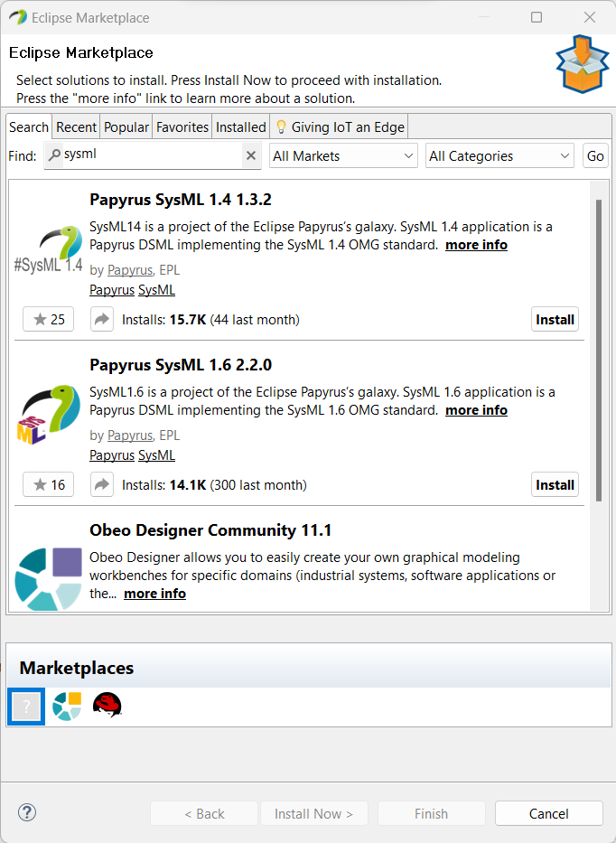

# Papyrus installation

1. Download the papyrus installer: 
    1. Linux: https://www.eclipse.org/downloads/download.php?file=/modeling/mdt/papyrus/rcp/2022-03/6.1.0/papyrus-2022-03-6.1.0-linux64.tar.gz&mirror_id=1190 
    1. Windows: https://www.eclipse.org/downloads/download.php?file=/modeling/mdt/papyrus/rcp/2022-03/6.1.0/papyrus-2022-03-6.1.0-win64.zip 
1. Extract the downloaded file.
1. Start Papyrus from the  _papyrus-\<version\>/Papyrus_ folder
1. Open Eclipse Marketplace: **Help**->**Eclipse Marketplace**, then search for _sysml_ and install the **Papyrus SysML 1.6** extension. Pay attention to the version number.

{height=48%}

# User Interface

## Model Explorer
One of the most used part of the interface is the **Model Explorer**, which shows the elements of our model as a containment tree. The search field helps a lot with bigger models.

{height=50%}

## New project, package, diagram

1. From the **File** -> **New** -> **Papyrus Project** menu, choose a **SysML 1.6** project

{height=50%}

2. In the **Model Explorer** windows, **right click** on the model -> **New Child** -> **Package**

{height=50%}

3. **Right click** on the newly created _Package_ -> **New Diagram** -> choose the desired diagram type

## Diagram properties and the Palette

{height=40%}

## Deletion of model elements

We have multiple ways of deleting model elements:
- From the **Model Explorer**, where any deletion affects the entire model
- From an **opened diagram**, where the element can either be deleted **just from the diagram** or the **entire model**. The default action bound to the **Delete** button deletes the element from the entire model, so pay attention! 

{height=40%}

# EMF Compare

