# Preliminaries

For the successful installation and licensing of Enterprise Architect, SmartGit and LemonTree Desktop, the following files will be necessary:

* `easetupfull_x86.exe`: Enterprise Architect installation file
* `smartgit-22_1_7-setup.exe`: SmartGit installation file
* `smartgit.lic`: SmartGit license
* `LemonTree.msi`: LemonTree Desktop installation file
* `desktop.lic`: LemonTree Desktop license

Furthermore, the activation codes and license server credentials are also needed for licensing Enterprise Architect.

# Enterprise Architect

Launching the installer, the wizard takes the user through the installation steps. Administrator permissions are necessary. All default values are suitable as-is.

After installation, launch Enterprise Architect. The following windows should greet the user:

Click `Add Key`, then select `Get Shared Key`. Complete the form using your name and company (e.g., `BME`):

Click on the three dots next to `Shared Keystore`, and fill in the form using the license server details (the screenshot has non-working info):

Click `Test`, which should succeed, then click `OK`. Under `Select a Product`, choose the correct edition, then click `OK`. The License Management window should now be populated:

Click `Close`. A new window should appear, prompting for an activation code. Fill in the code, accept the agreement (after reading it through), then click `OK`. The main window of EA should now open. 

# SmartGit

Launch the installer (Administrator permission are necessary). The default values are suitable as-is.  

Launch SmartGit, and agree to the license agreement. Check `Register existing license`, and provide the path to the SmartGit license:

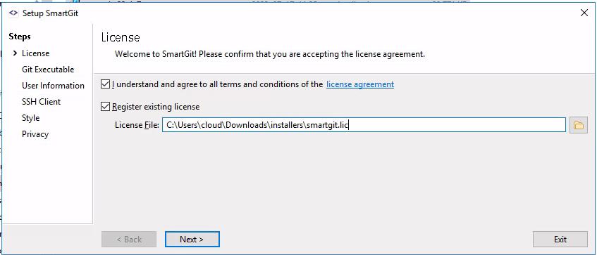

In the pop-up window, click OK. The next window asks for username and email, **use the same as you normally use for Git and GitHub**. In the next window, select `Use SmartGit as SSH client`, then, in the next window, select `Working tree`. Finish the setup by clicking through the rest of the windows.

Next, SmartGit should open, prompting for opening a repository:

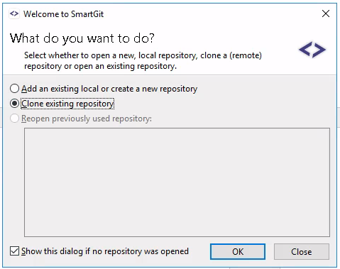

Choose `Clone existing`, and fill in the repository URL:

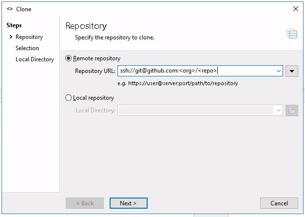

Note that the above example uses SSH authentication. To acquire an SSH key, open `cmd` from the start menu, and type `ssh-keygen`. For default values, hit Enter for all questions (in lieu of answers):

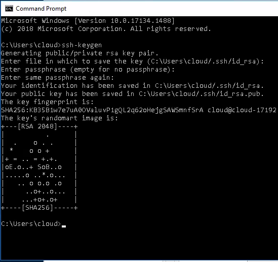

This created a pair of files in the `.ssh` folder (mind the dot!) of the current user's directory:

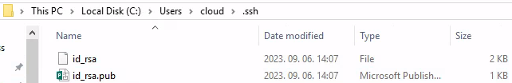

Open the `id_rsa.pub` file using Notepad, and copy the entire contents of the file. 

Next, go to [https://github.com/settings/keys](https://github.com/settings/keys), and click on `New SSH key`. Add a descriptive title for the key, select `Authentication key`, and paste the value of the key from the previious step:

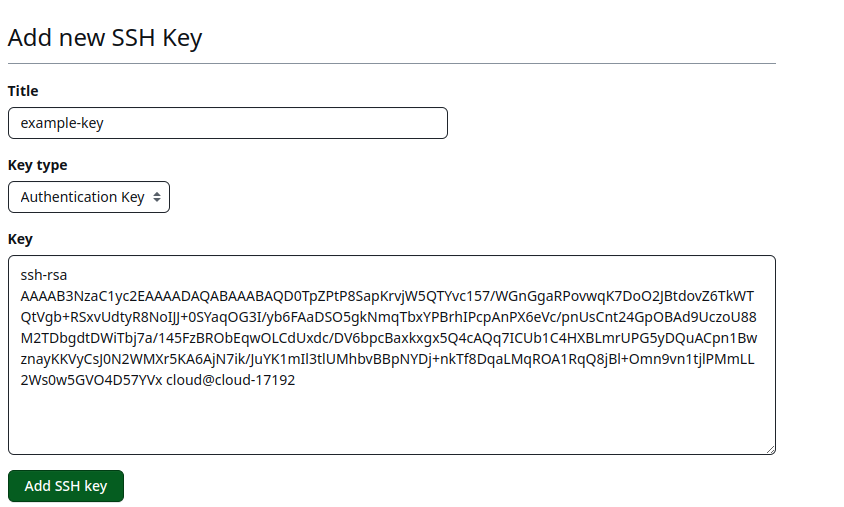

Go back to SmartGit, which should prompt you to select a private key file. Browse to the `.ssh/id_rsa` file (_without_ the `.pub` extension), and leave the passphrase empty (if you opted for a password in the `ssh-keygen` part, enter that passphrase):

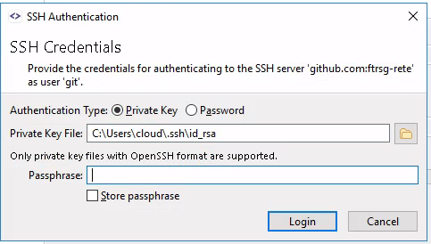

Click `Accept` on the server certificate. Next, leave the default options about cloning preferences, then on the next window, choose the target folder of the repository. Click `Next/OK` a few times, and the main window should open:

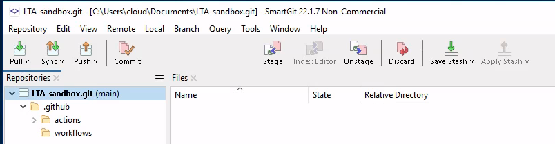

Close SmartGit for now.

# LemonTree Desktop

Launch the LemonTree installer, and click through the installer. Make sure that `SmartGit Integration` is selected on the `Custom Setup` page:

All other options are suitable as-is. 

After finishing the installation, launch LemonTree. In the pop-up windows (or through the top-left menu, Help, License), choose `Apply New License`:

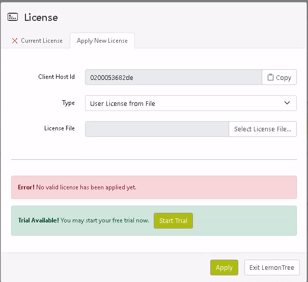

Choose the license file, then click `Apply`. Close LemonTree for now. 

# Testing the Software

Open SmartGit, and clone the tutorial homework assignment repository. The following window should open:

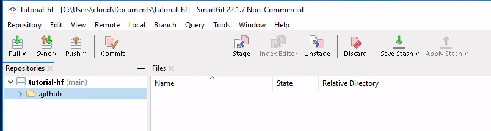

Open the folder in Explorer, and check if the files were successfully cloned:

Open `model.qeax` using Enterprise Architect.

## Task 1

_Modify the diagram by renaming Class 2 to something more informative. Save and commit to a new (feature) branch. Push the branch to remote._

Open `Class Diagram`: 

Select `Class2` on the diagram, then on the right, in the `Properties` window, rename the element:

Save the model. Open back SmartGit, and hit `F7` to add a new branch. Name it however you like, e.g., `feature`:

Hit `Add Branch and Checkout`. 

In the main window, `model.qeax` should be shown (because it has changed):

Double click the file, and LemonTree should appear:

This window summarizes the changes of the uncommited file. There are four different areas:

1. The top-left rectangle shows the model hierarchy of the changed elements (here, only `Class2` is changed).

2. The bottom-left rectangle shows the impacted diagrams (here, `Class Diagram` only)

3. The top-right (or top-center) rectangle shows the comparison between the original model and the new model hierarchy from the root element

4. The bottom-right (or bottom-center) rectangle shows the visualized changes (select the diagram on the bottom-left first!)

Inspect the changes, and close LemonTree. In SmartGit, click on `Commit`, and a window should appear that shows `model.qeax` has changed:

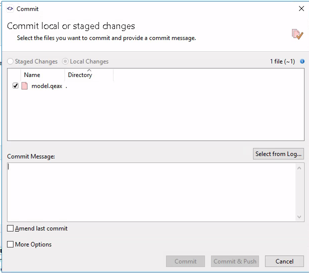

Add a descriptive (!) commit message, and click `Commit`. Then click on `Push`. (Or select `Commit and Push`).

## Task 2

_Open a pull request from the new branch towards main._

Open the repo on GitHub, and select the newly pushed feature branch:

Click on `Contribute`, then click on `Open Pull Request`. Fill in the title and the description:

Click on `Create pull request`. This starts a pipeline of checks, some of which need to pass before merging is allowed:

Wait until the checks pass (only those with `Required` labels are necessary, the rest are optional). These checks will also create some comments on the pull request:

If required checks pass, you can merge the PR. **For the sake of a later exercise, do not yet merge this PR**.

## Task 3

_Checkout the main branch again, re-open the model, and rename Class 2 to another name, different to that of step 1. Save and commit to a new (feature) branch. Push the branch to remote._

Repeat **Task 1** with a different branch and modification. Note that after changing branches, you need to restart EA for it to realize the changes have taken place.

## Task 4

_Open a pull request from the new branch towards main. If the checks pass, merge the PR._

Repeat **Task 2** with the new branch, then after checks pass, merge the modifications:

## Task 5

_Look at the first PR again. See if there is a merge issue (there should be). In SmartGit, checkout the branch corresponding to the first PR. Try and merge (or rebase) main into this branch. Recognize there is a merge issue (there should be). Using LemonTree (from within SmartGit), solve the merge issue by choosing one of the modifications (doesn't matter which). Commit and push the results. Merge the PR._

On the first PR, the following message forbids merging now:

Open SmartGit, checkout `main` (double-click on the bottom left), then click `Pull` to pull the changes. Checkout the first feature branch, then select `main` and click merge on the right-click (context) menu. A prompt should appear, choose `merge`, which should prompt with a warning that there is a merge issue:

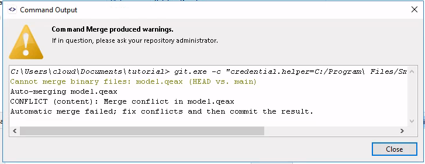

Click `Close` on this popup, then double-click the conflicting `model.qeax` to open in LemonTree.

After LemonTree opens, instead of 2, now there are 3 columns in the right partition: "ours", "theirs", and "target". We can see the current (first) feature branch's modifications in the "ours" column, the second feature branch's modifications in the "theirs" column, and the desired outcome in the "target" column. Open down the hierarchy on the top right:

To accept "their" modification, click on the "Take" button. Then click on the "Merge" button above, which will open a new popup:

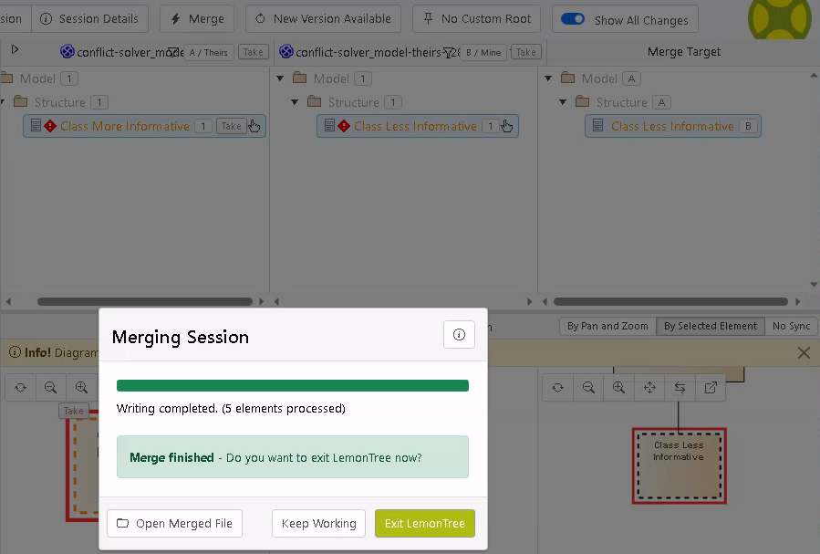

Exit LemonTree. In SmartGit, click on `Mark resolved`:

Then, click commit to finalize the merge. Click `Commit & Push`. After checks pass, merge the first PR. 