# Preliminaries

For the successful installation and licensing of Enterprise Architect, SmartGit and LemonTree Desktop, the following files will be necessary:

* `easetupfull_x86.exe`: Enterprise Architect installation file
* `smartgit-24_1-preview-13-setup.exe`: SmartGit installation file
* `LemonTree.msi`: LemonTree Desktop installation file

Furthermore, the activation codes and license server credentials are also needed for licensing the tools.

# Enterprise Architect

Launching the installer, the wizard takes the user through the installation steps. Administrator permissions are necessary. All default values are suitable as-is.

After installation, launch Enterprise Architect. The following windows should greet the user:

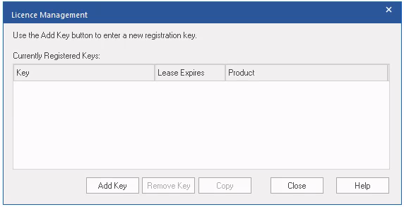

Click `Add Key`, then select `Get Shared Key`. Complete the form using your name and company (e.g., `BME`):

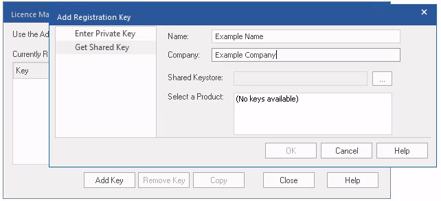

Click on the three dots next to `Shared Keystore`, and fill in the form using the license server details (the screenshot has non-working info):

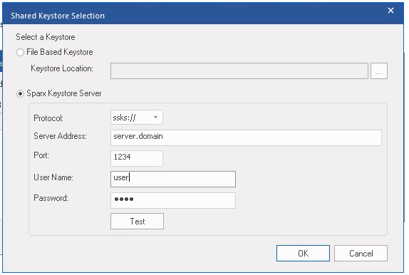

Click `Test`, which should succeed, then click `OK`. Under `Select a Product`, choose the correct edition, then click `OK`. The License Management window should now be populated:

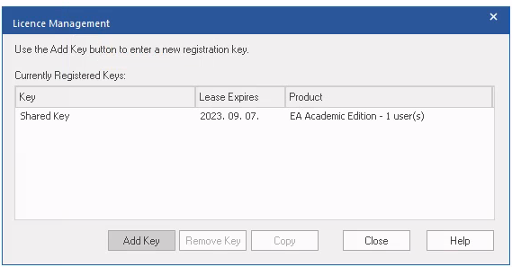

Click `Close`. A new window should appear, prompting for an activation code. Fill in the code, accept the agreement (after reading it through), then click `OK`. The main window of EA should now open. 

# SmartGit

Launch the installer (Administrator permission are necessary). The default values are suitable as-is.

Launch SmartGit, and choose "Standard (workflow oriented)" style. The next window asks for username and email, **use the same as you normally use for Git and GitHub**. Next, agree to the license agreement. Check `Register existing license`, and click on the "Have an on-premise license server?" text in the bottom right corner:

Next, provide the address and port (together with the `http://` part) for the license server:

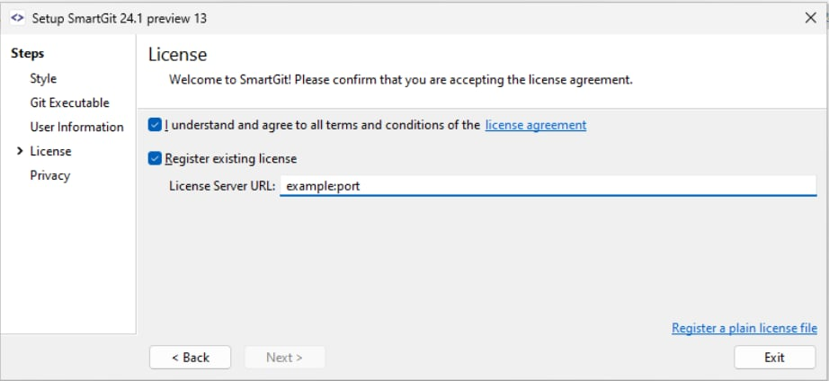

In the pop-up window, click OK. Finish the setup by clicking through the rest of the windows.

Next, SmartGit should open:

Next, click `Edit`/`Preferences`:

Choose `Add`/`GitHub`, and decide which option is best for you (for personal computers, the latter is easier and safe enough):

In the following screen, click `Generate token`:

This should open a browser. Log in to GitHub on the opened webpage. After a successful login, the following page should appear in the browser:

In the meantime, SmartGit should have populated the token textbox. Without modifying it, click `Add`.

On the main page, click `Clone`, and search for the desired repository to clone:

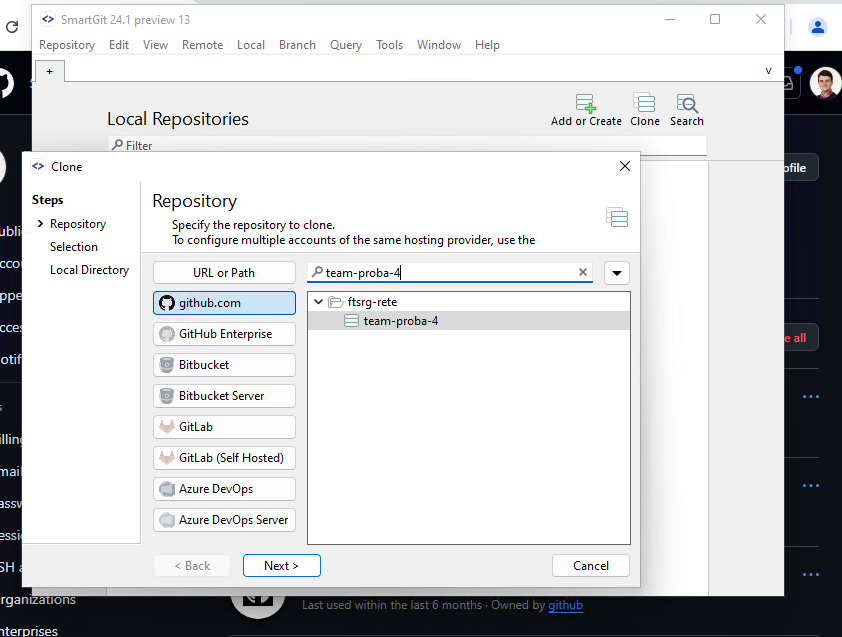

After some dialog windows (where default options are OK), this should start the cloning process:

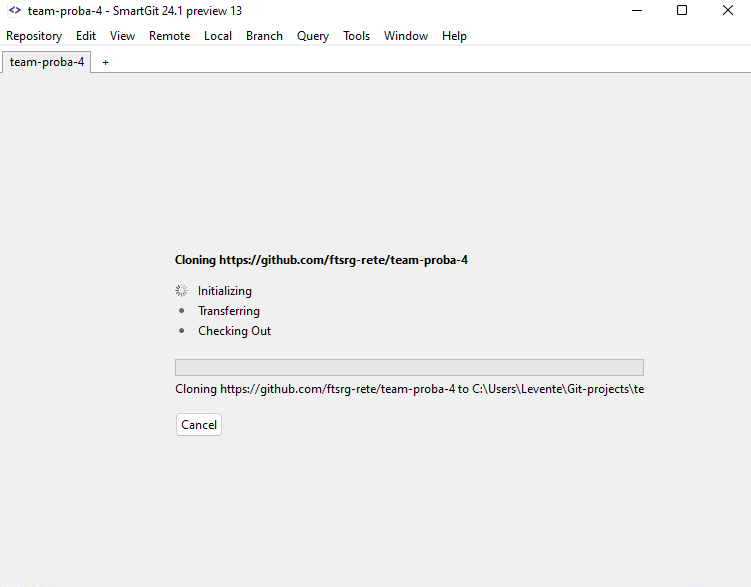

Close SmartGit for now.

# LemonTree Desktop

Launch the LemonTree installer, and click through the installer. Make sure that `SmartGit Integration` is selected on the `Custom Setup` page:

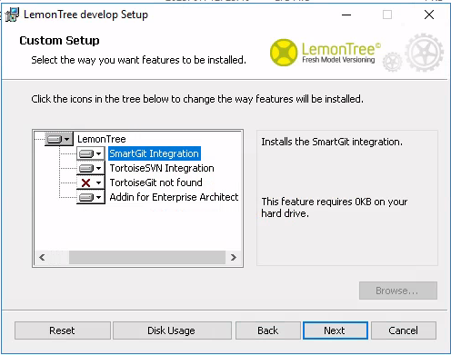

All other options are suitable as-is. 

After finishing the installation, launch LemonTree. In the pop-up windows (or through the top-left menu, Help, License), choose `Apply New License`, and `Floating license from URL`:

Write in the license server information, then click `Apply`. Close LemonTree for now. 

# Testing the Software

Open SmartGit, and clone the tutorial homework assignment repository (if you haven't already). Click on `Local files` on the top left, and right-click the root folder, and open it in Explorer:

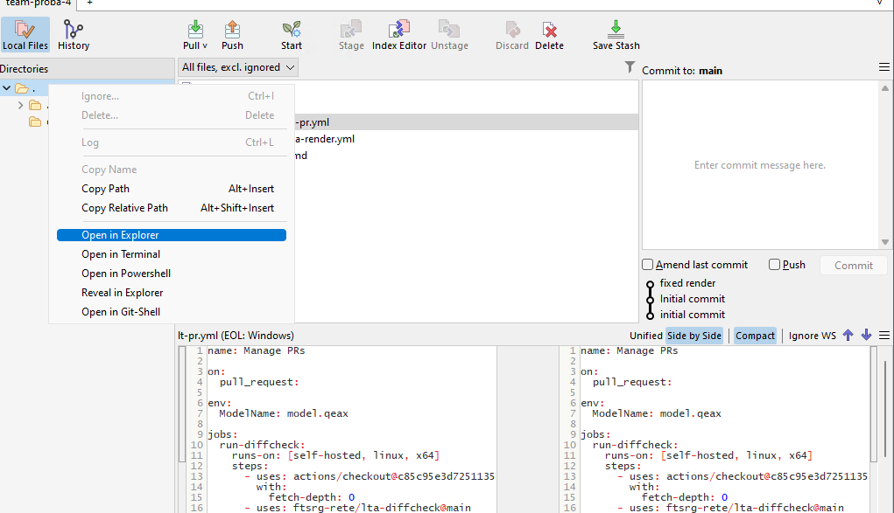

Check if the files were successfully cloned:

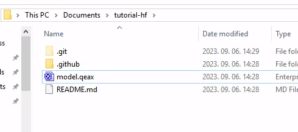

Open `model.qeax` using Enterprise Architect.

## Task 1

_Modify the diagram by renaming Class 2 to something more informative. Save and commit to a new (feature) branch. Push the branch to remote._

Open `Class Diagram`: 

Select `Class2` on the diagram, then on the right, in the `Properties` window, rename the element:

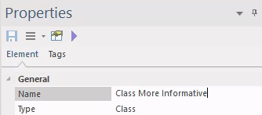

Save the model. Open back SmartGit, and hit `F7` to add a new branch. Name it however you like, e.g., `feature`:

Hit `Add Branch and Checkout`. 

In the main window, `model.qeax` should be shown (because it has changed):

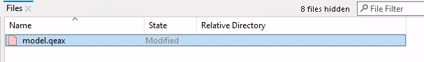

Double click the file, and LemonTree should appear:

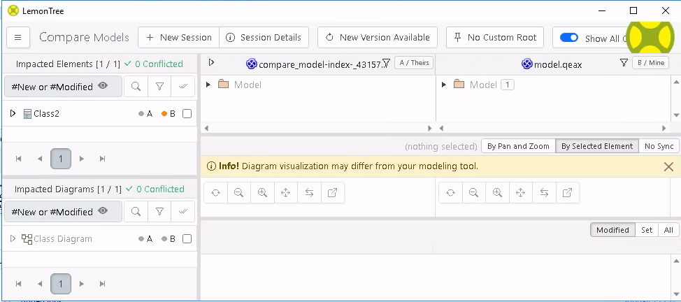

This window summarizes the changes of the uncommited file. There are four different areas:

1. The top-left rectangle shows the model hierarchy of the changed elements (here, only `Class2` is changed).

2. The bottom-left rectangle shows the impacted diagrams (here, `Class Diagram` only)

3. The top-right (or top-center) rectangle shows the comparison between the original model and the new model hierarchy from the root element

4. The bottom-right (or bottom-center) rectangle shows the visualized changes (select the diagram on the bottom-left first!)

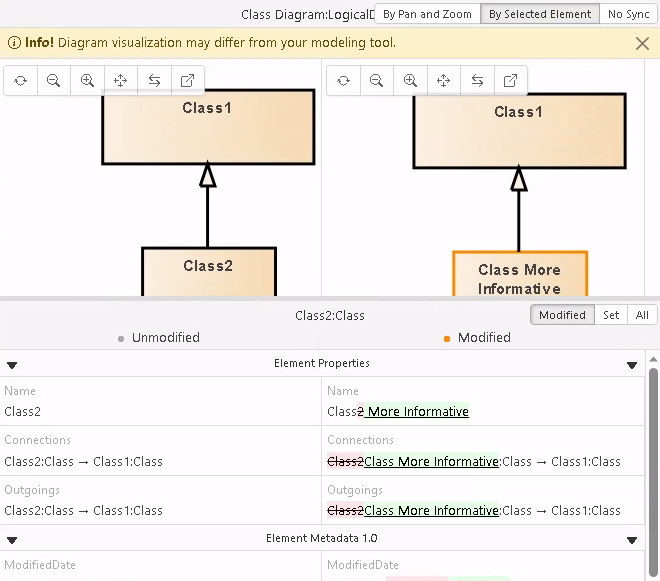

Inspect the changes, and close LemonTree. In SmartGit (still in the "Local files" view), click on `Stage` when the changed file is selected, then on the right, provide a descriptive (!) commit message, and click `Commit`. Then click on `Push`. (Or select `Commit and Push`):

## Task 2

_Open a pull request from the new branch towards main._

Open the repo on GitHub, and select the newly pushed feature branch:

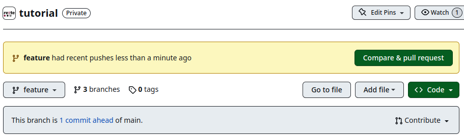

Click on `Contribute`, then click on `Open Pull Request`. Fill in the title and the description:

Click on `Create pull request`. This starts a pipeline of checks, some of which need to pass before merging is allowed:

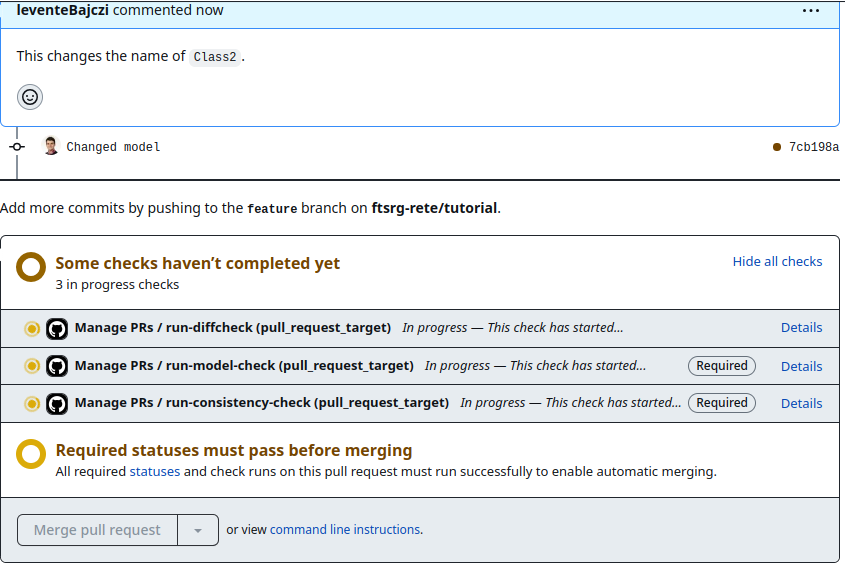

Wait until the checks pass (only those with `Required` labels are necessary, the rest are optional). These checks will also create some comments on the pull request:

If required checks pass, you can merge the PR. **For the sake of a later exercise, do not yet merge this PR**.

## Task 3

_Checkout the main branch again, re-open the model, and rename Class 2 to another name, different to that of step 1. Save and commit to a new (feature) branch. Push the branch to remote._

Repeat **Task 1** with a different branch and modification. Note that after changing branches, you need to restart EA for it to realize the changes have taken place.

## Task 4

_Open a pull request from the new branch towards main. If the checks pass, merge the PR._

Repeat **Task 2** with the new branch, then after checks pass, merge the modifications:

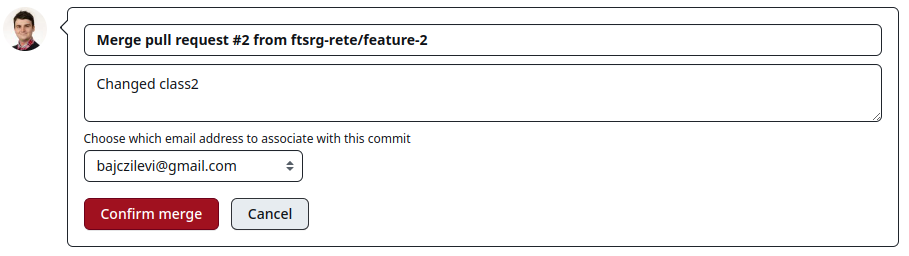

## Task 5

_Look at the first PR again. See if there is a merge issue (there should be). In SmartGit, checkout the branch corresponding to the first PR. Try and merge (or rebase) main into this branch. Recognize there is a merge issue (there should be). Using LemonTree (from within SmartGit), solve the merge issue by choosing one of the modifications (doesn't matter which). Commit and push the results. Merge the PR._

On the first PR, the following message forbids merging now:

Open SmartGit, checkout `main` (double-click on the bottom left), then click `Pull` to pull the changes. Checkout the first feature branch, then select `main` and click merge on the right-click (context) menu. A prompt should appear asking how the merge should be performed:

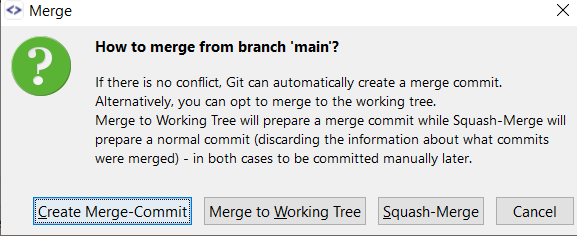

Choose `Create Merge Commit`. As there is a conflict, the merge commit cannot be created automatically, so choosing `Create Merge-Commit` and `Merge to Working tree` will both result in entering the merging state:

Double-click the conflicting `model.qeax` to open in LemonTree.

After LemonTree opens, instead of 2, now there are 3 columns in the right partition: "ours", "theirs", and "target". We can see the current (first) feature branch's modifications in the "ours" column, the second feature branch's modifications in the "theirs" column, and the desired outcome in the "target" column. Open down the hierarchy on the top right:

To accept "their" modification, click on the "Take" button. Then click on the "Merge and exit lemon tree" button above, which will open a new popup:

In SmartGit, click on `Mark resolved`:

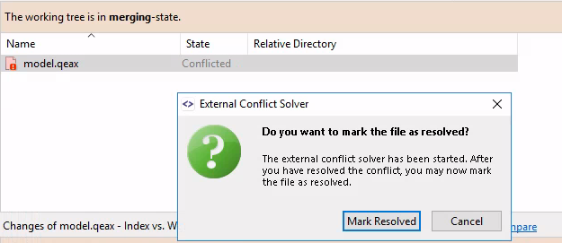

Then, click commit to finalize the merge. Click `Commit & Push`. After checks pass, merge the first PR. 
