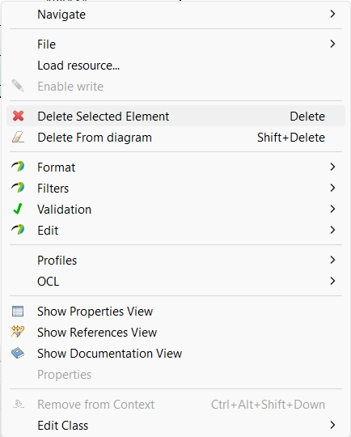

# Papyrus telepítése

1. Papyrus telepítő letöltése: 
    1. Linux: https://www.eclipse.org/downloads/download.php?file=/modeling/mdt/papyrus/rcp/2022-03/6.1.0/papyrus-2022-03-6.1.0-linux64.tar.gz&mirror_id=1190 
    1. Windows: https://www.eclipse.org/downloads/download.php?file=/modeling/mdt/papyrus/rcp/2022-03/6.1.0/papyrus-2022-03-6.1.0-win64.zip 
1. Tömörítsük ki a letöltött zip-et.
1. A _papyrus-\<version\>/Papyrus_ mappából indítsuk el a Papyrus-t
1. Nyissuk meg az Eclipse Marketplace-t: **Help**->**Eclipse Marketplace**, majd keressünk rá a _sysml_ kiegészítőkre és telepítsük fel a **Papyrus SysML 1.6** kiegészítőt. Figyeljünk a verzióra!

{height=48%}

# Felhasználói felület

## Model Explorer
A felhasználói felület egyik leggyakrabban használt része a **Model Explorer**, ami fa szerkezetben mutatja modellünk elemeit. A tartalmazási hierarchia miatt nagy elemszámú modelleken könnyen átláthatlanná válhat, ezért az alján található kereső sokat segíthet az eligazodásban.

{height=50%}

## Új project, package, diagram létrehozása

1. A **File** -> **New** -> **Papyrus Project** menüből válasszuk ki a **SysML 1.6** projektet

{height=50%}

2. A **Model Explorer**-ben **Jobb katt** a modellen -> **New Child** -> **Package**

{height=50%}

3. **Jobb katt** az elkészült _Package_-en -> **New Diagram** -> válasszuk ki a listából a feladatnak megfelelő diagramot

## Diagram tulajdonságai és a Palette

{height=40%}

## Modellelemek törlése

Modellelemek törlésére lehetőségünk van:
- a **Model Explorer**-ben, ahol a teljes modellből törlődik a kiválaszott elem
- a **megnyitott diagramon** a modellelemet törölhetjük csak az adott diagramról vagy a teljes modellből, ezért figyeljünk melyiket választjuk! A **Delete** billenytű lenyomása alapértelmezetten a teljes modellből töröl! 

{height=40%}

# EMF Compare

