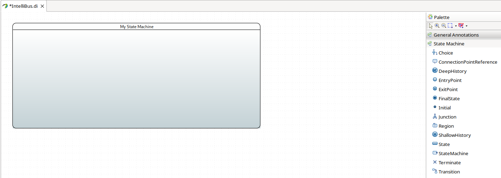
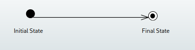
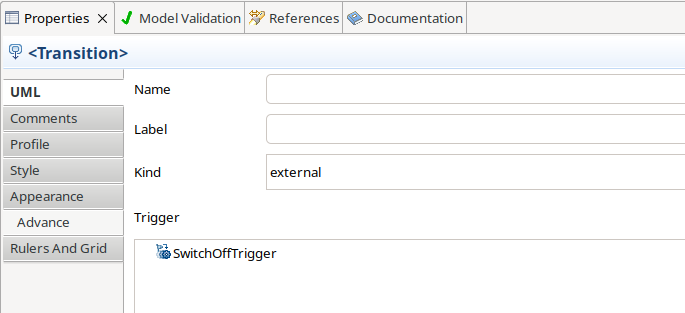
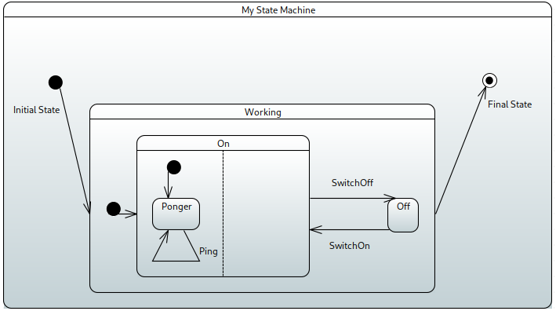
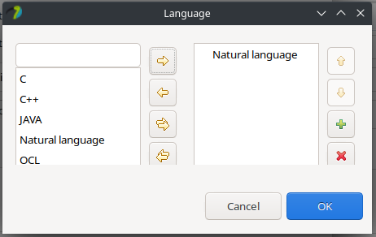
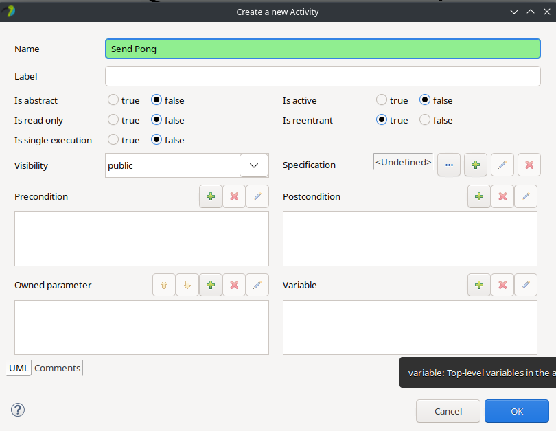
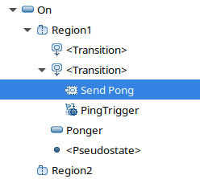
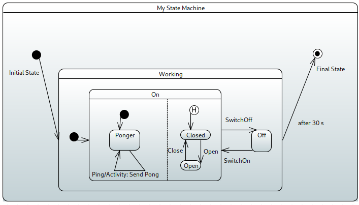
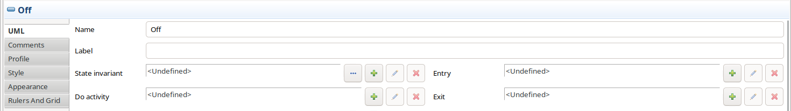
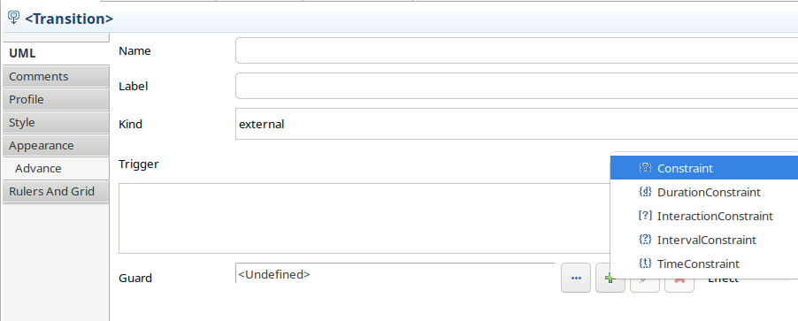

 
# Diagram creation

Inside the Model Explorer windows of Papyrus, right-click the destination package, and choose _new diagram_/_SysML 1.6 State Machine Diagram_.

This should create the following structure in the model explorer window. Note the state machine has a single region (inside statemachine, regions and states alternate in the containment hierarchy).

Visually, the state machine editor should look like this.

# Basic Structure

From the palette window to the right, drag and drop an initial state, a final state and a transition connecting the two onto the diagram area.

Now drop a state from the palette onto the diagram, and connect the initial and final states in the following way:

This should create the following structure in the model explorer. Note that the _Working_ state has no children.

Now drop a state _inside_ the _Working_ state. This will automatically create a region inside the state (to preserve the alternating regions and states), and place the new states inside. 

Visually, nested states look like as follows (with added triggers between the On and Off states):

To add behavior to the state machine, we can define _triggers_, _guards_ and _actions_/_effects_ on transitions. First, let's create a _trigger_ on the transitions between the On and Off states. To do so, choose the _trigger_ box in the transition's properties window, and create a trigger just like in activity diagrams.

To specify which port the trigger signal might arrive, use the properties window:

Visually, a trigger will appear as a label on the diagram.

So far, nested states created an _OR_-refinement of the container states. To create _AND_-refinement (a.k.a. orthogonal regions), drag and drop a region inside the On state. Firstly, this is done without any problems, but when dropping the second one, the editor expects the user to decide how they want to divide the state (horizontally or vertically). Here, we chose a vertical division.

Next, add a state and an initial state inside one of the regions, with a self-loop transition containing a trigger for the signal _Ping_.

The _Ponger_ state should reply with a _Pong_ every time it receives a _Ping_. This is achieved by using an _effect_ on the transition. Locate the _effect_ box inside the transition's properties window, and add an opaque behavior. 

Choose a language for the opaque behavior. Here we chose to use "Natural Language" so we can use english words on the transition.

Add the text describing the behavior to the text box on the right. 

An alternative to the opaque behavior (which uses informal descriptions) is to use an activity behavior.

This will prompt the user to provide a name for the activity.

In the model explorer, the activity is shows as the child of the transition - to edit the contents of the effect, create a separate activity diagram and drop the activity onto its diagram area.

Visually, an effect is shows as text after the divisor "/" in the label of the transition.

To create a history state (instead of an initial state), drop the corresponding element onto the diagram area.  

As the transition towards the final state has been triggered by the completition event so far (thus rendering the inside of the Working state inoperable), we need to add a trigger to it. If we choose to create a timing event, we can do so using the same technique as for _accept event actions_ in activity diagrams. The summary can be seen below:

Visually, time-based triggers are shown with either an _after_ or an _at_ label, depending on the relative-ness of the event.

If we want to invoke specific behaviors every time a state is entered/exited, we can use _entry_ and _exit_ actions on the state.

Here, the same rules apply as to effects of transitions - we can simply create opaque behaviors, or model them using for example activity diagrams.

Visually, these labels are shown inside the state.

To accept a trigger _and then_ decide what to do, we can use the _decision_ pseudostate. To create the guards, we can use the properties window of the transitions.

Visually, guards are represented using brackets, as seen below.

