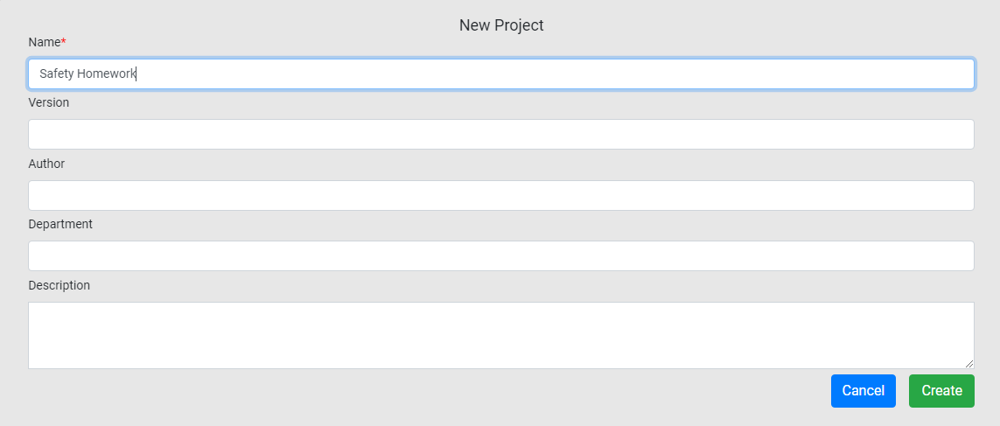
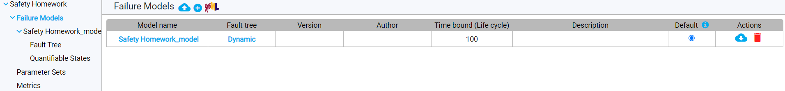
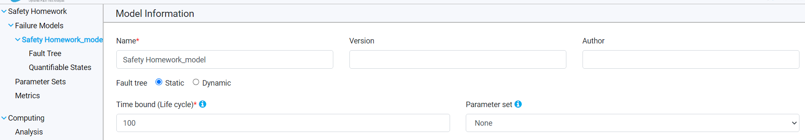
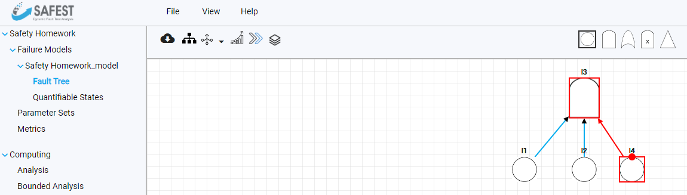
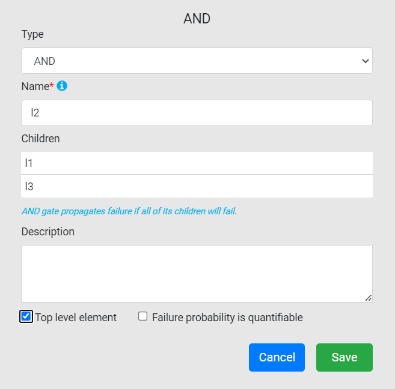
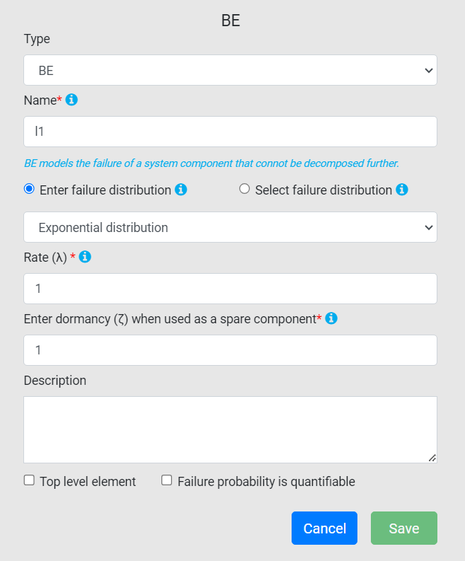
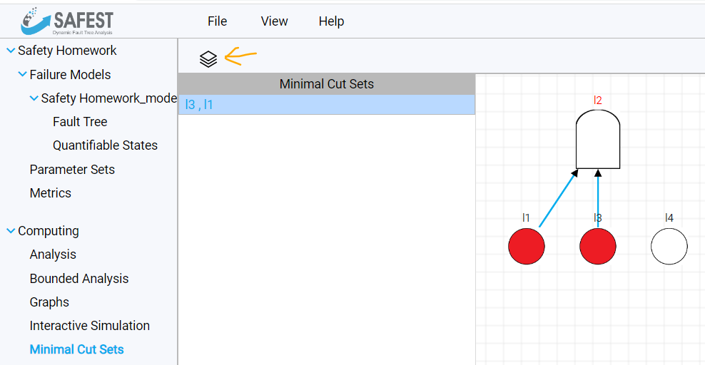
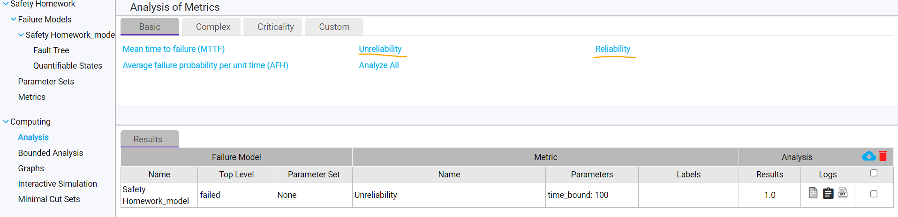
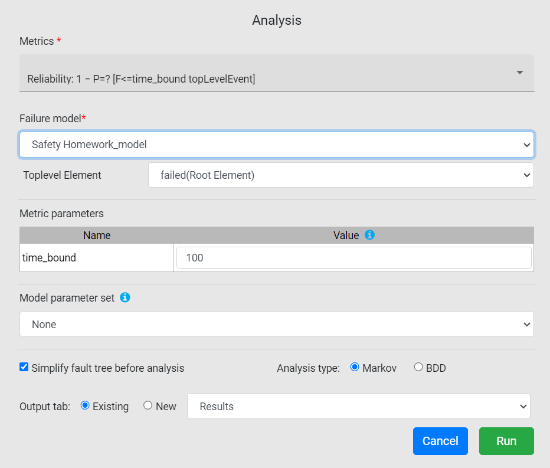

# Introduction

FTEdit is a fault tree editing and analysis tool for static and dynamic fault trees. As the Systems Engineering course covers only static fault tree, only a subset of its features will be needed.

# Installation

Installation and execution instruction for SAFEST can be found **[here](https://github.com/DGBTechnologies/SAFEST)**. A license is also needed to run the tool, you can register for a free academic license **[here](https://www.safest.dgbtek.com/src/components/licenses/dft-licenses.html)**.

# Modeling and evaluating static fault trees

1. You can create a new project from **File**->**New Project**.

2. Enter the name of the project (all the other fields are optional.

3. A project can contain multiple failure models, which you can see under **Failure Models** on the left side. One failure model is automatically created together with the project.

4. You can change the properties of the model itself if you select it on the sidebar. Make sure to change the type of the fault tree to **Static**, as not all types of analysis are available for dynamic fault tree (e.g. cut set computation). Another important property is the **Time Bound (life cycle)**: the calculated reliability values will correspont to this time. Don't forget to click the save button after changing the properties.

5. The fault tree can be edited after selecting the **Fault Tree** label under the corresponding failure model on the sidebar. The toolbox can be seen at the top of the editor pane. The leftmost element on it is a **Basic Event**, which is followed by the **AND**, **OR**, and **VOT** (voting) gates. The last one is a **BLOCK** gate, which functions like an import: it copies another whole fault tree model into the current fault tree. It can be used to make large models easier to read -- you don't have to use it in this course. If you see other gates in the toolbox, then the fault tree type is likely set to dynamic in the failure model properties.

You can create new elements by clicking on the canvas while an element type is selected in the toolbox. An element type remains selected after clicking it until you click it again. Edges can be created by hovering over an element (making a red dot appear), and dragging the red dot to another element. Only gates can have incoming edges. You can delete an element or an edge by right-clicking it and selecting **remove element/edge** from the context menu.

6. The properties of an element can be edited by left-clicking it. Both gates and basic events can be named from here, and you can make them top-level by clicking the **top level element** check-box at the bottom. You must have exactly one top-level element in the tree before analysing it. 

Basic Events have failure distributions. Choose **Enter Failure Distribution** if you want to specify the distribution in place and **Select Failure Distribution** if you want to select from the distributions specified in a parameter set (we won't discuss parameter sets here, you don't have to use them in your assignment). Use **Exponential Distribution** distribution if a failure rate is given, your  and you want SAFEST to compute the reliability of the component at the end of the life cycle. Neither the failure rates, nor the time parameters use units of measurement, so make sure to use numeric values with consistent units throughout the project. Use **Probability**, if you want to explicitly specify the probability that the event happened (the corresponding component is in a failed state or the component is unavailable, depending on the aim of the analysis), ignoring the life cycle property of the failure model. Other distribution types aren't needed for this assignment.

7. You can compute the minimal cut sets of the fault tree by selecting **Minimal Cut Sets** under **Computing** on the sidebar. Click the icon above the (currently empty) minimal cut list to perform the computation. Select the failure model you are interested in and click **Start**. The minimal cut set list will be populated by the results. The selected cut set is visualized on the right.

8. You can perform quantitative analysis by selecting **Analysis** under **Computing** on the sidebar. From the available metric, we will be interested in **Unreliability** and **Reliability** in this assignment. Keep in mind that fault trees describe the system from a negative perspective, so the probability of the top event happening during the life cycle will be the Unreliability metric.

After choosing the metric of interest, a window will appear where you can set parameters of the analysis. You do not have to change anything here (you can override the life cycle duration here by changing the time_bound value if you want to), just click **Run**. The results will appear in the results table.
