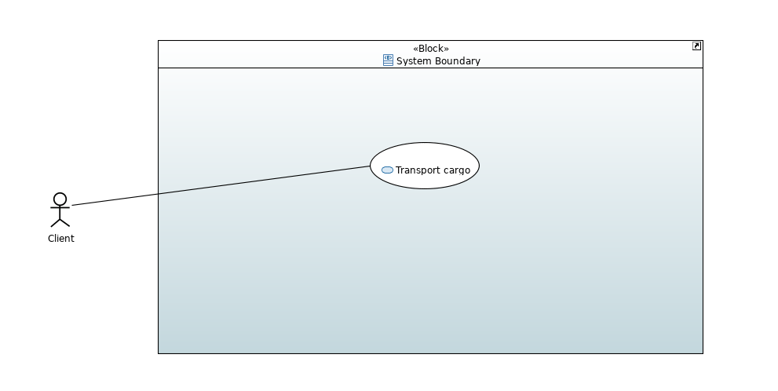
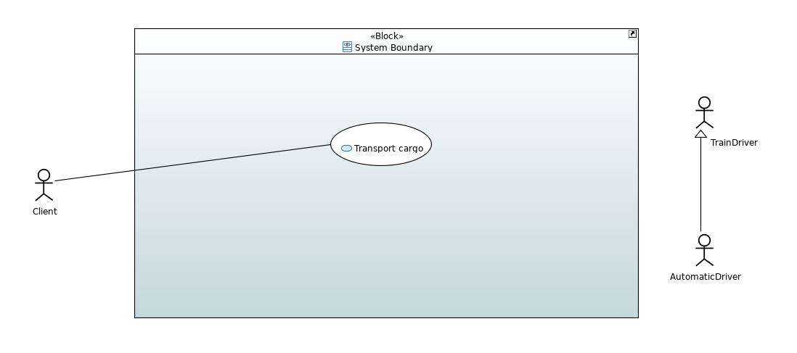
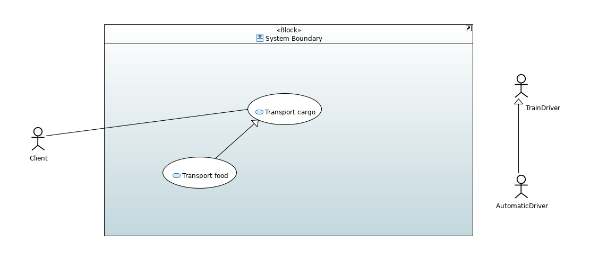

# Requirement modeling

## Diagram Creation

1. **Right click** on the selected _Package_ (_Requirements_ in this example) -> **New Diagram** -> **SysML 1.6 Requirement Diagram**.

2. To add a _Requirement_ select **Requirement** from the **Palette** and place it on the diagram, then on the **Properties** window, in the **SysML 1.6** tab fill out the **Id** and the **Text** fields.

## Requirement Decomposition

1. For _Requirement Decomposition_ select **Containment Link** from the **Palette** and connect two _Requirements_. Pay attention to the direction of the connection!

## Deriving Requirements

1. To _Derive Requirements_ select **DeriveReqt** from the **Palette** and connect two _Requirements_. Pay attention to the direction of the connection!

# Use Case modeling

## Diagram Creation

1. **Right click** on the selected _Package_ (_UseCases_ in this example) -> **New Diagram** -> **SysML 1.6 Use Case Diagram**.

2. **Drag-and-drop** a block representing the boundry of the system (_System Boundary_) from the **Model Explorer** to the diagram.

## Adding Actors and Use Cases

1. To add an _Actor_ select **Actor** from the **Palette** and place it on the diagram. 

2. To add a _Use Case_ select **Use Case** from the **Palette** and place it on the diagram. 

3. To add an _Association_ between the _Actor_ and the _Use Case_ select **Communication Path** from the **Palette** and connect the _Actor_ and the _Use Case_. 

## Relations between Actors

1. To _Generalize_ _Actors_ select **Generalization** from the **Palette** and connect two _Actors_. Pay attention to the direction of the connection!

## Relations between Use Cases

1. To _Generalize_ _Use Cases_ select **Generalization** from the **Palette** and connect two _Use Cases_. Pay attention to the direction of the connection!

2. To _Refine_ a _Use Case_ select **Include** from the **Palette** and connect two _Use Cases_. Pay attention to the direction of the connection!

3. To _Extend_ a _Use Case_ select **Extend** from the **Palette** and connect two _Use Cases_. Pay attention to the direction of the connection!

# Traceability

## Diagram Creation

1. **Right click** on the selected _Package_ (_UseCases_ in this example) -> **New Diagram** -> **SysML 1.6 Block Definition Diagram**.

2. **Drag-and-drop** the _Requirement_ (_Transport Cargo_) from the **Model Explorer** to the diagram.

3. **Drag-and-drop** the _Block_ satisfying the _Requirement_ (_Transportation Subsystem_) from the **Model Explorer** to the diagram.

4. To _Satisfy_ the _Requirement_ select **Abstraction** from the **Palette** and connect the _Block_ to the _Requirement_. Than on the **Properties** window, on the **Profile** tab add the **Satisfy** _Stereotype_-t. The **Satisfy** _Stereotype_ must be in the **Applied Stereotypes** column!

