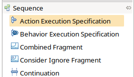

 
# Diagram creation

Inside the Model Explorer windows of Papyrus, right-click the destination package, and choose _new diagram_/_SysML 1.6 Sequence Diagram_.

This should create the following structure in the model explorer window. 

Visually, the sequence diagram editor should look like this.

# Structure

To add lifelines of participants (parts) to the interaction, drag and drop blocks onto the diagram area, or choose the lifeline element in the palette to the right. 

Messages (including found & lost messages) can be added via the same palette.

To set the contents of the message, add the corresponding signal in the properties window (as a signature).

Execution specifications can also be added from the palette.

Ensure that the execution speficiation has reasonable start and finish points (events). Here, _start_ is bound to the message reception, but _finish_ has no constraint.

Synchronous and asynchronous messages can be added from the palette to the diagram are between lifelines. Such messages need not contain a signal, if the semantics of the message do not require such specification (e.g., a return message does not need to specify a type).

Combined fragments are a bit cumbersome to use, because they re-arrange the containment hierarchy in the model explorer every time they are moved (and thus include/exclude some elements). The type of the fragment can be selected from a drop-down in the properties window.

The label of the combined fragment is added via simple string literals using the properties window.

State invariants are added from the palette onto lifelines. 

The specification of the state invariant is done through the constraint pop-up in the properties window.

Instead of duration constraints (which are not supported for SysML sequence diagrams in Papyrus), we can use time constraints at specific events. Add a time constraint from the palette onto a lifeline at a message send/receive point:

Ensure that the constrained element is sensible (not unconstrained):

To show a duration, use an initial "t[N]" label, then an offset. Here, a 10 second offset is used to specify that the duration of the execution specification is 10 seconds. Note that separate starting points are necessary for the lifelines (i.e., do not use t[0] on the second lifeline in the example).

